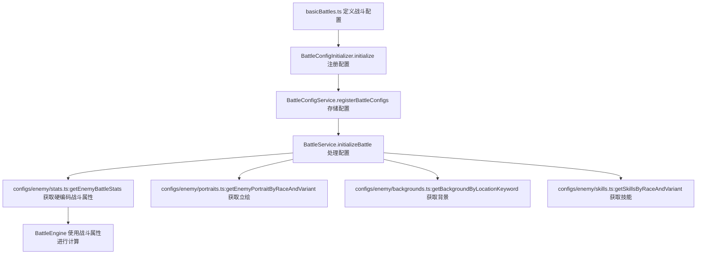

# 敌人系统重构方案

> 最后更新: 2025-01-30
> 版本: 1.0

## 重构背景

当前战斗子系统中的敌人配置存在以下问题：

1. **数据结构冗余**: 敌人同时包含 `mvuAttributes` 和 `stats` 两套属性系统
2. **属性转换复杂**: 需要通过 `BattleService.mapMvuToBattleStats` 将MVU属性转换为战斗属性
3. **立绘系统静态**: 敌人立绘直接在配置中硬编码URL，无法动态选择
4. **背景选择缺失**: 缺少基于MVU `location` 变量的背景图片选择机制
5. **敌人类型单一**: 缺少1-20级敌人的系统化配置

## 当前系统分析

### 敌人数据导入流程



### 当前敌人数据结构

```typescript
// basicBattles.ts 中的敌人配置
{
  id: 'enemy_goblin',
  name: '哥布林',
  side: 'enemy',
  level: 1,
  skills: ['power_strike'],
  enemyPortrait: {
    image: 'https://example.com/goblin.png', // 硬编码URL
    position: { x: 0.75, y: 0.4, scale: 0.7 }
  },
  mvuAttributes: {  // MVU属性
    力量: 8, 敏捷: 6, 防御: 4, 体质: 5, 魅力: 2, 幸运: 3, 意志: 4
  }
}
```

### MVU变量中的敌人数据

```yaml
# mvu变量表.yml
enemies:
  $meta:
    recursiveExtensible: true
    Id: 
      template: 未知敌人名称
      variantId: 未知敌人变体ID  # 用于立绘选择
      gender: 未知
      race: 未知                 # 用于立绘选择
      level: 1                   # 敌人等级
      attributes:                # 敌人属性
        strength: 10
        agility: 10
        defense: 10
        constitution: 10
        charisma: 10
        willpower: 10
        luck: 10
```

### 重构后的MVU变量结构

重构后，敌人数据将完全从MVU变量中获取，包括：

1. **敌人基础信息**：
   - `enemies.{enemyId}.name` - 敌人名称
   - `enemies.{enemyId}.variantId` - 敌人变体ID
   - `enemies.{enemyId}.gender` - 敌人性别
   - `enemies.{enemyId}.race` - 敌人种族
   - `enemies.{enemyId}.level` - 敌人等级

2. **敌人属性**：
   - `enemies.{enemyId}.attributes.strength` - 力量
   - `enemies.{enemyId}.attributes.agility` - 敏捷
   - `enemies.{enemyId}.attributes.defense` - 防御
   - `enemies.{enemyId}.attributes.constitution` - 体质
   - `enemies.{enemyId}.attributes.charisma` - 魅力
   - `enemies.{enemyId}.attributes.willpower` - 意志
   - `enemies.{enemyId}.attributes.luck` - 幸运

3. **战斗相关数据**：
   - `location` - 当前战斗位置（用于背景选择）
   - 其他战斗相关的MVU变量

## 重构目标

### 1. 简化数据结构

- 移除 `mvuAttributes` 依赖和属性转换逻辑
- 直接使用硬编码的战斗属性（`stats`）
- 统一血量管理
- 基于种族和变体ID确定敌人类型

### 2. 实现1-20级敌人系统

- 每个等级3种类型：普通、高闪避、高法攻
- 系统化的属性平衡设计
- 可配置的技能系统

### 3. 动态立绘系统

- 基于 `race` 和 `variantId` 的立绘选择
- 支持立绘资源映射表
- 可扩展的立绘变体系统

### 4. 背景图片映射

- 基于MVU `location` 变量的背景选择
- 支持地点关键字匹配
- 可配置的背景资源映射

## 详细重构方案

### 1. 新的敌人配置结构

```typescript
interface EnemyConfig {
  id: string;
  name: string;
  level: number; // 1-20
  type: 'normal' | 'high_dodge' | 'high_magic';
  race: string; // 对应MVU变量中的race
  variantId: string; // 对应MVU变量中的variantId
  
  // 硬编码的战斗属性（从配置表获取）
  stats: {
    atk: number;           // 物理攻击
    hatk: number;          // 魔法攻击
    def: number;           // 物理防御
    hdef: number;          // 魔法防御
    hit: number;           // 命中率
    evade: number;         // 闪避率
    critRate: number;      // 暴击率
    critDamageMultiplier: number; // 暴击伤害倍数
    hhp: number;           // 魔法血量
  };
  
  // 血量直接配置
  maxHp: number;
  
  // 技能配置
  skills: string[];
  
  // 特殊技能视频配置
  skillVideos?: {
    [skillId: string]: VideoConfig;
  };
}
```

### 敌人只读配置层（新增）

- 目的：将敌人“硬编码战斗属性、技能、立绘、背景、类型映射”等数据统一放入只读配置层，便于服务与组合式函数按需读取，避免数据散落。
- 目录与文件：

```text
src/同层游玩RPG_remake/configs/
  └─ enemy/
     ├─ types.ts         // getEnemyTypeByRaceAndVariant, EnemyType 等类型与映射
     ├─ stats.ts         // ENEMY_BATTLE_STATS_CONFIG, getEnemyBattleStats(level, type)
     ├─ skills.ts        // getSkillsByRaceAndVariant(race, variantId)
     ├─ portraits.ts     // getEnemyPortraitByRaceAndVariant(race, variantId)
     ├─ backgrounds.ts   // getBackgroundByLocationKeyword(location)
     ├─ catalog.ts       // (可选) 敌人目录 ENEMY_CATALOG, getEnemyInfoById(id)
     └─ index.ts         // 统一导出上述函数与类型
```

- 使用约定：
  - 组合式函数和服务层不得在业务代码内重新定义这些映射/表格，应统一从 `configs/enemy` 导入。
  - 如需变更数值或资源，仅修改 `configs/enemy` 中对应文件。

### 2. 敌人类型平衡设计

#### 普通型 (normal)

- 平衡的属性分布
- 适合新手教学
- 基础技能配置

#### 高闪避型 (high_dodge)

- 高敏捷、高闪避率
- 低物理防御
- 适合敏捷系技能

#### 高法攻型 (high_magic)

- 高意志、高魔法攻击
- 低物理攻击
- 适合魔法系技能

### 3. 立绘资源映射系统

```typescript
const ENEMY_PORTRAIT_MAP = {
  '人类': {
    '战士': 'https://example.com/human_warrior.png',
    '法师': 'https://example.com/human_mage.png',
    '盗贼': 'https://example.com/human_rogue.png',
  },
  '兽人': {
    '战士': 'https://example.com/orc_warrior.png',
    '萨满': 'https://example.com/orc_shaman.png',
  },
  '精灵': {
    '弓箭手': 'https://example.com/elf_archer.png',
    '德鲁伊': 'https://example.com/elf_druid.png',
  },
  // ... 更多种族和变体
};

// 立绘选择函数
function getEnemyPortrait(race: string, variantId: string): string {
  const raceMap = ENEMY_PORTRAIT_MAP[race];
  if (!raceMap) {
    return 'https://example.com/default_enemy.png';
  }
  
  const portrait = raceMap[variantId];
  return portrait || raceMap['default'] || 'https://example.com/default_enemy.png';
}
```

### 4. 背景图片映射系统

```typescript
const LOCATION_BACKGROUND_MAP = {
  '街道': 'https://images.unsplash.com/photo-1449824913935-59a10b8d2000?w=1920&h=1080&fit=crop',
  '学校': 'https://images.unsplash.com/photo-1523050854058-8df90110c9f1?w=1920&h=1080&fit=crop',
  '森林': 'https://images.unsplash.com/photo-1441974231531-c6227db76b6e?w=1920&h=1080&fit=crop',
  '地牢': 'https://images.unsplash.com/photo-1518709268805-4e9042af2176?w=1920&h=1080&fit=crop',
  '城市': 'https://images.unsplash.com/photo-1477959858617-67f85cf4f1df?w=1920&h=1080&fit=crop',
  '神殿': 'https://images.unsplash.com/photo-1506905925346-21bda4d32df4?w=1920&h=1080&fit=crop',
  // ... 更多地点映射
};

// 背景选择函数
function getBackgroundByLocation(location: string): string {
  // 关键字匹配
  for (const [keyword, backgroundUrl] of Object.entries(LOCATION_BACKGROUND_MAP)) {
    if (location.includes(keyword)) {
      return backgroundUrl;
    }
  }
  
  // 默认背景
  return 'https://images.unsplash.com/photo-1441974231531-c6227db76b6e?w=1920&h=1080&fit=crop';
}
```

### 5. 1-20级敌人配置生成

```typescript
// 敌人配置生成器
class EnemyConfigGenerator {
  private static readonly RACES = ['人类', '兽人', '精灵', '矮人', '龙族'];
  private static readonly VARIANTS = ['战士', '法师', '盗贼', '弓箭手', '萨满'];
  
  // 生成1-20级敌人配置
  static generateEnemyConfigs(): EnemyConfig[] {
    const configs: EnemyConfig[] = [];
    
    for (let level = 1; level <= 20; level++) {
      for (const type of ['normal', 'high_dodge', 'high_magic'] as const) {
        for (const race of this.RACES) {
          for (const variant of this.VARIANTS) {
            const config = this.createEnemyConfig(level, type, race, variant);
            configs.push(config);
          }
        }
      }
    }
    
    return configs;
  }
  
  private static createEnemyConfig(
    level: number, 
    type: 'normal' | 'high_dodge' | 'high_magic',
    race: string,
    variant: string
  ): EnemyConfig {
    // 直接从硬编码配置表获取战斗属性
    const battleStats = getEnemyBattleStats(level, type);
    
    return {
      id: `${race}_${variant}_${type}_l${level}`,
      name: `${race}${variant}`,
      level,
      type,
      race,
      variantId: variant,
      stats: battleStats,
      maxHp: battleStats.maxHp,
      skills: this.getSkillsByRaceAndVariant(race, variant),
    };
  }
  
  private static getSkillsByRaceAndVariant(race: string, variant: string): string[] {
    // 复用之前定义的技能映射逻辑
    return getSkillsByRaceAndVariant(race, variant);
  }
}
```

## 实施计划

### 阶段1: useStatData.ts 组合式函数扩展

1. **扩展敌人数据获取方法**
   - 添加 `getEnemyFullInfo()` 方法获取敌人完整信息
   - 添加 `getAllEnemiesFullInfo()` 方法获取所有敌人信息
   - 添加 `getCurrentBattleBackground()` 方法获取战斗背景
   - 添加 `getEnemyPortrait()` 方法获取敌人立绘
   - 添加 `getBackgroundByLocationKeyword()` 和 `getEnemyPortraitByRaceAndVariant()` 工具方法

2. **更新返回值**
   - 在 `useStatData.ts` 的 return 语句中添加新的方法
   - 确保所有新方法都可以被其他组件调用

3. **测试MVU数据获取**
   - 验证敌人数据的MVU变量路径正确性
   - 测试背景图片映射功能
   - 测试立绘选择功能

### 阶段2: 数据结构重构

1. 更新 `BattleSchemas.ts` 中的敌人数据结构
2. 移除 `BattleService.mapMvuToBattleStats` 方法
3. 更新 `BattleService.initializeBattle` 方法
4. 新增只读配置层目录 `src/同层游玩RPG_remake/configs/enemy/`
5. 将硬编码战斗属性表落地到 `configs/enemy/stats.ts`
6. 将类型映射落地到 `configs/enemy/types.ts`
7. 新增 `configs/enemy/skills.ts`、`configs/enemy/portraits.ts`、`configs/enemy/backgrounds.ts`、`configs/enemy/index.ts`
8. （可选）新增 `configs/enemy/catalog.ts` 维护敌人目录

### 阶段3: 战斗配置生成系统

1. **创建动态战斗配置生成器**
   - 实现 `generateDynamicBattleConfig()` 函数
   - 实现 `generateEnemyBattleConfig()` 函数
   - 实现 `getEnemyBattleStats()` 函数
   - 实现 `getEnemyTypeByRaceAndVariant()` 函数
   - 实现 `getSkillsByRaceAndVariant()` 函数

2. **更新战斗系统集成**
   - 修改 `useBattleSystem`/`useBattleConfig` 使用 `configs/enemy` 暴露的只读函数
   - 组合式函数不再内联映射或表格，统一从 `configs/enemy` 引入
   - 确保与现有战斗流程兼容

### 阶段4: 立绘和背景系统实现

1. **立绘系统实现**
   - 完善 `ENEMY_PORTRAIT_MAP` 映射表
   - 实现基于 `race` 和 `variantId` 的立绘选择
   - 更新 `BattleScene` 中的立绘加载逻辑

2. **背景映射系统**
   - 完善 `LOCATION_BACKGROUND_MAP` 映射表
   - 实现基于 `location` 的背景选择
   - 更新战斗配置生成逻辑

### 阶段5: 敌人配置生成

1. 创建 `EnemyConfigGenerator` 类
2. 生成1-20级敌人配置
3. 更新 `BattleConfigInitializer` 注册新配置

### 阶段6: 测试和优化

1. 测试新的敌人系统
2. 优化性能和用户体验
3. 完善错误处理
4. 验证MVU数据获取的稳定性

## 技术实现细节

### 1. useStatData.ts 组合式函数修改

#### 1.1 扩展敌人数据获取方法

```typescript
// 在 useStatData.ts 中添加新的敌人数据获取方法

/**
 * 获取敌人完整信息（包含ID、名字、属性等）
 */
const getEnemyFullInfo = async (enemyId: string): Promise<{
  id: string;
  name: string;
  variantId: string;
  gender: string;
  race: string;
  level: number;
  attributes: Record<string, number>;
} | null> => {
  try {
    // 从MVU变量中获取敌人基础信息
    const name = (await statDataBinding?.getAttributeValue(`enemies.${enemyId}.name`, '未知敌人')) || '未知敌人';
    const variantId = (await statDataBinding?.getAttributeValue(`enemies.${enemyId}.variantId`, '未知')) || '未知';
    const gender = (await statDataBinding?.getAttributeValue(`enemies.${enemyId}.gender`, '未知')) || '未知';
    const race = (await statDataBinding?.getAttributeValue(`enemies.${enemyId}.race`, '未知')) || '未知';
    const level = (await statDataBinding?.getAttributeValue(`enemies.${enemyId}.level`, 1)) || 1;

    // 获取敌人属性
    const attributes: Record<string, number> = {};
    for (const attrName of CHINESE_ATTRIBUTE_NAMES) {
      const englishName = getEnglishAttributeName(attrName);
      const value = (await statDataBinding?.getAttributeValue(`enemies.${enemyId}.attributes.${englishName}`, 0)) || 0;
      attributes[attrName] = Number(value);
    }

    return {
      id: enemyId,
      name,
      variantId,
      gender,
      race,
      level,
      attributes,
    };
  } catch (error) {
    console.error('[useStatData] 获取敌人完整信息失败:', error);
    return null;
  }
};

/**
 * 获取所有在场敌人的完整信息列表
 */
const getAllEnemiesFullInfo = async (): Promise<Array<{
  id: string;
  name: string;
  variantId: string;
  gender: string;
  race: string;
  level: number;
  attributes: Record<string, number>;
}>> => {
  try {
    const enemyRoot = (await statDataBinding?.getAttributeValue('enemies', {})) || {};
    const enemies = enemyRoot && typeof enemyRoot === 'object' ? enemyRoot : {};
    
    const results = [];
    for (const [enemyId, _enemyData] of Object.entries(enemies)) {
      const enemyInfo = await getEnemyFullInfo(enemyId);
      if (enemyInfo) {
        results.push(enemyInfo);
      }
    }
    
    return results;
  } catch (error) {
    console.error('[useStatData] 获取所有敌人完整信息失败:', error);
    return [];
  }
};

/**
 * 获取当前战斗位置的背景图片
 */
const getCurrentBattleBackground = async (): Promise<string> => {
  try {
    const location = await statDataBinding?.getCurrentLocation() || '未知地点';
    return getBackgroundByLocationKeyword(location);
  } catch (error) {
    console.error('[useStatData] 获取战斗背景失败:', error);
    return 'https://images.unsplash.com/photo-1441974231531-c6227db76b6e?w=1920&h=1080&fit=crop'; // 默认背景
  }
};

/**
 * 根据地点关键字获取背景图片
 */
const getBackgroundByLocationKeyword = (location: string): string => {
  const LOCATION_BACKGROUND_MAP = {
    '街道': 'https://images.unsplash.com/photo-1449824913935-59a10b8d2000?w=1920&h=1080&fit=crop',
    '学校': 'https://images.unsplash.com/photo-1523050854058-8df90110c9f1?w=1920&h=1080&fit=crop',
    '森林': 'https://images.unsplash.com/photo-1441974231531-c6227db76b6e?w=1920&h=1080&fit=crop',
    '地牢': 'https://images.unsplash.com/photo-1518709268805-4e9042af2176?w=1920&h=1080&fit=crop',
    '城市': 'https://images.unsplash.com/photo-1477959858617-67f85cf4f1df?w=1920&h=1080&fit=crop',
    '神殿': 'https://images.unsplash.com/photo-1506905925346-21bda4d32df4?w=1920&h=1080&fit=crop',
    '洞穴': 'https://images.unsplash.com/photo-1506905925346-21bda4d32df4?w=1920&h=1080&fit=crop',
    '城堡': 'https://images.unsplash.com/photo-1506905925346-21bda4d32df4?w=1920&h=1080&fit=crop',
    '村庄': 'https://images.unsplash.com/photo-1449824913935-59a10b8d2000?w=1920&h=1080&fit=crop',
    '荒野': 'https://images.unsplash.com/photo-1441974231531-c6227db76b6e?w=1920&h=1080&fit=crop',
  };

  // 关键字匹配
  for (const [keyword, backgroundUrl] of Object.entries(LOCATION_BACKGROUND_MAP)) {
    if (location.includes(keyword)) {
      return backgroundUrl;
    }
  }
  
  // 默认背景
  return 'https://images.unsplash.com/photo-1441974231531-c6227db76b6e?w=1920&h=1080&fit=crop';
};

/**
 * 根据种族和变体ID获取敌人立绘
 */
const getEnemyPortraitByRaceAndVariant = (race: string, variantId: string): string => {
  const ENEMY_PORTRAIT_MAP = {
    '人类': {
      '战士': 'https://example.com/human_warrior.png',
      '法师': 'https://example.com/human_mage.png',
      '盗贼': 'https://example.com/human_rogue.png',
      '弓箭手': 'https://example.com/human_archer.png',
      '牧师': 'https://example.com/human_priest.png',
    },
    '兽人': {
      '战士': 'https://example.com/orc_warrior.png',
      '萨满': 'https://example.com/orc_shaman.png',
      '狂战士': 'https://example.com/orc_berserker.png',
      '猎手': 'https://example.com/orc_hunter.png',
    },
    '精灵': {
      '弓箭手': 'https://example.com/elf_archer.png',
      '德鲁伊': 'https://example.com/elf_druid.png',
      '法师': 'https://example.com/elf_mage.png',
      '游侠': 'https://example.com/elf_ranger.png',
    },
    '矮人': {
      '战士': 'https://example.com/dwarf_warrior.png',
      '工匠': 'https://example.com/dwarf_craftsman.png',
      '牧师': 'https://example.com/dwarf_priest.png',
    },
    '龙族': {
      '龙战士': 'https://example.com/dragon_warrior.png',
      '龙法师': 'https://example.com/dragon_mage.png',
      '龙骑士': 'https://example.com/dragon_knight.png',
    },
  };

  const raceMap = ENEMY_PORTRAIT_MAP[race];
  if (!raceMap) {
    return 'https://example.com/default_enemy.png';
  }
  
  const portrait = raceMap[variantId];
  return portrait || raceMap['default'] || 'https://example.com/default_enemy.png';
};

/**
 * 获取敌人立绘URL
 */
const getEnemyPortrait = async (enemyId: string): Promise<string> => {
  try {
    const race = (await statDataBinding?.getAttributeValue(`enemies.${enemyId}.race`, '未知')) || '未知';
    const variantId = (await statDataBinding?.getAttributeValue(`enemies.${enemyId}.variantId`, '未知')) || '未知';
    
    return getEnemyPortraitByRaceAndVariant(race, variantId);
  } catch (error) {
    console.error('[useStatData] 获取敌人立绘失败:', error);
    return 'https://example.com/default_enemy.png';
  }
};
```

#### 1.2 更新返回值

```typescript
// 在 useStatData.ts 的 return 语句中添加新的方法
return {
  // ... 现有返回值 ...
  
  // 新增的敌人数据获取方法
  getEnemyFullInfo,
  getAllEnemiesFullInfo,
  getCurrentBattleBackground,
  getBackgroundByLocationKeyword,
  getEnemyPortraitByRaceAndVariant,
  getEnemyPortrait,
  
  // ... 其他返回值 ...
};
```

### 2. 服务层修改

```typescript
// 新的 EnemyConfigService - 现在依赖 useStatData 提供的方法
@injectable()
export class EnemyConfigService {
  private portraitMap: Map<string, Map<string, string>> = new Map();
  private backgroundMap: Map<string, string> = new Map();
  
  constructor(
    @inject(TYPES.StatDataBindingService) private statDataBinding: StatDataBindingService
  ) {
    this.initializeMappings();
  }
  
  // 获取敌人立绘 - 现在通过 useStatData 获取
  async getEnemyPortrait(enemyId: string): Promise<string> {
    // 这里应该调用 useStatData 的 getEnemyPortrait 方法
    // 但由于服务层无法直接调用组合式函数，需要通过事件或其他方式
    const race = await this.statDataBinding.getAttributeValue(`enemies.${enemyId}.race`, '未知');
    const variantId = await this.statDataBinding.getAttributeValue(`enemies.${enemyId}.variantId`, '未知');
    
    return this.getPortraitByRaceAndVariant(race, variantId);
  }
  
  // 获取背景图片 - 现在通过 useStatData 获取
  async getBackgroundByLocation(): Promise<string> {
    const location = await this.statDataBinding.getCurrentLocation();
    return this.getBackgroundByLocationKeyword(location);
  }
}
```

### 3. 战斗配置更新

#### 3.1 通过 useStatData 与只读配置层生成动态战斗配置

```typescript
// 在战斗相关的 composable 中使用 useStatData 的方法
import { useStatData } from '../composables/useStatData';
import {
  getEnemyTypeByRaceAndVariant,
  getEnemyBattleStats,
  getSkillsByRaceAndVariant,
  getEnemyPortraitByRaceAndVariant,
  getBackgroundByLocationKeyword,
} from '../configs/enemy';

// 生成动态战斗配置的函数
export const generateDynamicBattleConfig = async (
  enemyId: string,
  playerConfig: BattleParticipant
): Promise<BattleConfig> => {
  // 在 Vue 组件中调用 useStatData
  const statData = useStatData();
  
  // 获取敌人完整信息
  const enemyInfo = await statData.getEnemyFullInfo(enemyId);
  if (!enemyInfo) {
    throw new Error(`无法获取敌人信息: ${enemyId}`);
  }
  
  // 获取背景图片（优先使用只读配置层的关键字匹配函数）
  const location = await statData.getCurrentLocation?.();
  const backgroundImage = location
    ? getBackgroundByLocationKeyword(location)
    : await statData.getCurrentBattleBackground();
  
  // 获取敌人立绘（使用只读配置层函数）
  const enemyPortrait = getEnemyPortraitByRaceAndVariant(enemyInfo.race, enemyInfo.variantId);
  
  // 根据敌人信息生成战斗配置
  const enemyConfig = generateEnemyBattleConfig(enemyInfo);
  
  return {
    background: {
      image: backgroundImage,
      scaleMode: 'cover'
    },
    participants: [
      playerConfig,
      {
        ...enemyConfig,
        side: 'enemy',
        enemyPortrait: {
          image: enemyPortrait,
          position: { x: 0.75, y: 0.4, scale: 0.8 }
        }
      }
    ]
  };
};

// 根据敌人信息生成战斗配置
const generateEnemyBattleConfig = (enemyInfo: {
  id: string;
  name: string;
  variantId: string;
  gender: string;
  race: string;
  level: number;
  attributes: Record<string, number>;
}): BattleParticipant => {
  // 根据敌人类型获取战斗属性（需要从MVU变量中获取敌人类型）
  const enemyType = getEnemyTypeByRaceAndVariant(enemyInfo.race, enemyInfo.variantId);
  const battleStats = getEnemyBattleStats(enemyInfo.level, enemyType);
  
  return {
    id: enemyInfo.id,
    name: enemyInfo.name,
    side: 'enemy',
    level: enemyInfo.level,
    maxHp: battleStats.maxHp,
    hp: battleStats.maxHp,
    stats: battleStats,
    skills: getSkillsByRaceAndVariant(enemyInfo.race, enemyInfo.variantId),
  };
};

// 根据种族和变体确定敌人类型
const getEnemyTypeByRaceAndVariant = (race: string, variantId: string): 'normal' | 'high_dodge' | 'high_magic' => {
  const TYPE_MAPPING: Record<string, Record<string, 'normal' | 'high_dodge' | 'high_magic'>> = {
    '人类': {
      '战士': 'normal',
      '法师': 'high_magic',
      '盗贼': 'high_dodge',
      '弓箭手': 'high_dodge',
      '牧师': 'normal',
    },
    '兽人': {
      '战士': 'normal',
      '萨满': 'high_magic',
      '狂战士': 'normal',
      '猎手': 'high_dodge',
    },
    '精灵': {
      '弓箭手': 'high_dodge',
      '德鲁伊': 'high_magic',
      '法师': 'high_magic',
      '游侠': 'high_dodge',
    },
    '矮人': {
      '战士': 'normal',
      '工匠': 'normal',
      '牧师': 'normal',
    },
    '龙族': {
      '龙战士': 'normal',
      '龙法师': 'high_magic',
      '龙骑士': 'normal',
    },
  };

  const raceMapping = TYPE_MAPPING[race];
  if (!raceMapping) {
    return 'normal'; // 默认类型
  }
  
  return raceMapping[variantId] || 'normal'; // 默认类型
};

// 硬编码的战斗属性配置表
const ENEMY_BATTLE_STATS_CONFIG = {
  // 1级敌人配置
  1: {
    normal: {
      atk: 12, hatk: 8, def: 10, hdef: 5, hit: 100.5, evade: 5,
      critRate: 0.05, critDamageMultiplier: 1.5, hhp: 0.1, maxHp: 100
    },
    high_dodge: {
      atk: 10, hatk: 8, def: 6, hdef: 5, hit: 100.5, evade: 25,
      critRate: 0.05, critDamageMultiplier: 1.5, hhp: 0.1, maxHp: 80
    },
    high_magic: {
      atk: 8, hatk: 15, def: 8, hdef: 10, hit: 100.5, evade: 5,
      critRate: 0.05, critDamageMultiplier: 1.5, hhp: 0.2, maxHp: 90
    }
  },
  // 2级敌人配置
  2: {
    normal: {
      atk: 14, hatk: 10, def: 12, hdef: 6, hit: 101.0, evade: 6,
      critRate: 0.05, critDamageMultiplier: 1.5, hhp: 0.1, maxHp: 120
    },
    high_dodge: {
      atk: 12, hatk: 10, def: 8, hdef: 6, hit: 101.0, evade: 28,
      critRate: 0.05, critDamageMultiplier: 1.5, hhp: 0.1, maxHp: 100
    },
    high_magic: {
      atk: 10, hatk: 18, def: 10, hdef: 12, hit: 101.0, evade: 6,
      critRate: 0.05, critDamageMultiplier: 1.5, hhp: 0.2, maxHp: 110
    }
  },
  // 3级敌人配置
  3: {
    normal: {
      atk: 16, hatk: 12, def: 14, hdef: 7, hit: 101.5, evade: 7,
      critRate: 0.05, critDamageMultiplier: 1.5, hhp: 0.1, maxHp: 140
    },
    high_dodge: {
      atk: 14, hatk: 12, def: 10, hdef: 7, hit: 101.5, evade: 31,
      critRate: 0.05, critDamageMultiplier: 1.5, hhp: 0.1, maxHp: 120
    },
    high_magic: {
      atk: 12, hatk: 21, def: 12, hdef: 14, hit: 101.5, evade: 7,
      critRate: 0.05, critDamageMultiplier: 1.5, hhp: 0.2, maxHp: 130
    }
  },
  // ... 继续到20级
  // 20级敌人配置
  20: {
    normal: {
      atk: 50, hatk: 40, def: 45, hdef: 25, hit: 110.0, evade: 25,
      critRate: 0.1, critDamageMultiplier: 2.0, hhp: 0.3, maxHp: 500
    },
    high_dodge: {
      atk: 45, hatk: 40, def: 30, hdef: 25, hit: 110.0, evade: 60,
      critRate: 0.1, critDamageMultiplier: 2.0, hhp: 0.3, maxHp: 400
    },
    high_magic: {
      atk: 35, hatk: 70, def: 40, hdef: 50, hit: 110.0, evade: 25,
      critRate: 0.1, critDamageMultiplier: 2.0, hhp: 0.5, maxHp: 450
    }
  }
};

// 获取敌人战斗属性（直接返回硬编码配置）
const getEnemyBattleStats = (level: number, type: 'normal' | 'high_dodge' | 'high_magic') => {
  const levelConfig = ENEMY_BATTLE_STATS_CONFIG[level];
  if (!levelConfig) {
    throw new Error(`未找到等级 ${level} 的敌人配置`);
  }
  
  const typeConfig = levelConfig[type];
  if (!typeConfig) {
    throw new Error(`未找到类型 ${type} 的敌人配置`);
  }
  
  return { ...typeConfig };
};

// 根据等级获取命中率
const getHitRateByLevel = (level: number): number => {
  const LEVEL_HIT_RATE_TABLE: Record<number, number> = {
    1: 100.5, 2: 101.0, 3: 101.5, 4: 102.0, 5: 102.5,
    6: 103.0, 7: 103.5, 8: 104.0, 9: 104.5, 10: 105.0,
    11: 105.5, 12: 106.0, 13: 106.5, 14: 107.0, 15: 107.5,
    16: 108.0, 17: 108.5, 18: 109.0, 19: 109.5, 20: 110.0,
  };
  
  const validLevel = Math.max(1, Math.min(20, level));
  return LEVEL_HIT_RATE_TABLE[validLevel] || 100.5;
};

// 根据种族和变体获取技能
const getSkillsByRaceAndVariant = (race: string, variantId: string): string[] => {
  const SKILL_MAP: Record<string, Record<string, string[]>> = {
    '人类': {
      '战士': ['power_strike', 'defend'],
      '法师': ['fireball', 'magic_missile'],
      '盗贼': ['precise_strike', 'stealth'],
      '弓箭手': ['precise_strike', 'multi_shot'],
      '牧师': ['heal', 'bless'],
    },
    '兽人': {
      '战士': ['power_strike', 'berserker_rage'],
      '萨满': ['lightning_bolt', 'heal'],
      '狂战士': ['power_strike', 'berserker_rage'],
      '猎手': ['precise_strike', 'track'],
    },
    '精灵': {
      '弓箭手': ['precise_strike', 'nature_arrow'],
      '德鲁伊': ['nature_bolt', 'heal'],
      '法师': ['fireball', 'ice_shard'],
      '游侠': ['precise_strike', 'animal_companion'],
    },
    '矮人': {
      '战士': ['power_strike', 'shield_bash'],
      '工匠': ['repair', 'craft'],
      '牧师': ['heal', 'bless'],
    },
    '龙族': {
      '龙战士': ['dragon_breath', 'power_strike'],
      '龙法师': ['dragon_breath', 'fireball'],
      '龙骑士': ['dragon_breath', 'charge'],
    },
  };

  const raceSkills = SKILL_MAP[race];
  if (!raceSkills) {
    return ['power_strike']; // 默认技能
  }
  
  const variantSkills = raceSkills[variantId];
  return variantSkills || ['power_strike']; // 默认技能
};
```

#### 3.2 在战斗系统中使用新的配置生成

```typescript
// 在 useBattleSystem 或相关 composable 中使用
export const useBattleConfig = () => {
  const statData = useStatData();
  
  const startBattleWithEnemy = async (enemyId: string) => {
    try {
      // 获取玩家配置
      const playerConfig = await getPlayerBattleConfig();
      
      // 生成动态战斗配置
      const battleConfig = await generateDynamicBattleConfig(enemyId, playerConfig);
      
      // 启动战斗
      await battleSystem.startBattle(battleConfig);
    } catch (error) {
      console.error('[useBattleConfig] 启动战斗失败:', error);
      throw error;
    }
  };
  
  return {
    startBattleWithEnemy,
    // ... 其他方法
  };
};
```

## 预期效果

### 1. 性能提升

- 移除MVU属性转换开销，直接使用硬编码配置
- 减少配置验证时间
- 提高战斗初始化速度
- 简化数据获取流程

### 2. 可维护性提升

- 统一的数据结构
- 清晰的职责分离
- 易于扩展的配置系统

### 3. 用户体验提升

- 动态立绘选择
- 智能背景匹配
- 丰富的敌人类型

### 4. 开发效率提升

- 自动化的配置生成
- 标准化的数据格式
- 完善的类型支持

## 风险评估

### 技术风险

- **低风险**: 数据结构变更影响范围可控
- **中风险**: 需要更新多个服务层组件
- **高风险**: 暂无

### 兼容性风险

- **低风险**: 新系统向后兼容现有配置
- **中风险**: 需要迁移现有战斗配置
- **高风险**: 暂无

## 总结

敌人系统重构将显著提升战斗子系统的可维护性和扩展性，同时为用户提供更丰富的游戏体验。通过移除MVU属性转换的复杂性，直接使用硬编码的战斗属性配置，简化数据结构，并实现动态立绘和背景选择，新的敌人系统将更加灵活和高效。

重构后的系统将支持1-20级的系统化敌人配置，每种敌人都有独特的硬编码属性和技能配置，为玩家提供多样化的战斗体验。通过基于种族和变体ID的敌人类型映射，系统能够自动为不同敌人分配合适的战斗属性。
