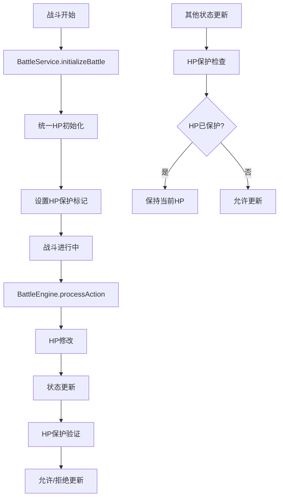

# HP初始化和修改机制统一方案

## 概述

本文档描述了同层游玩RPG_remake项目中HP（生命值）的初始化和修改机制的统一方案。该方案旨在解决当前战斗中HP被意外重置或回血的问题，确保HP值在战斗过程中只通过战斗逻辑进行更新。

## 问题分析

### 当前问题

通过控制台日志分析，发现以下HP管理问题：

1. **HP回血现象**：玩家和敌人的HP在受到伤害后会自动恢复到之前的值
2. **重复初始化**：HP在多个地方被初始化，导致状态不一致
3. **状态同步冲突**：状态更新时HP被意外覆盖
4. **缺乏统一管理**：没有统一的HP管理机制

### 根本原因

1. **初始化分散**：HP初始化逻辑分散在多个组件中
2. **状态更新时序**：状态更新事件的处理顺序导致HP被覆盖
3. **MVU映射干扰**：MVU属性映射可能重新计算HP值
4. **缺乏保护机制**：没有防止HP被意外修改的保护机制

## 解决方案

### 核心原则

1. **统一初始化**：HP只在战斗开始时初始化一次
2. **战斗机制管理**：初始化后，HP完全由BattleEngine管理
3. **职责分离**：明确各层级的HP管理职责
4. **状态保护**：防止非战斗逻辑修改HP

### 架构设计



## 实施计划

### 阶段1：统一HP初始化

#### 1.1 修改BattleService.initializeBattle

**目标**：在战斗初始化时统一设置HP，避免重复初始化

```typescript
// 在BattleService.initializeBattle中统一处理
const withStats: BattleConfig = {
  ...parsed.data,
  participants: parsed.data.participants.map(p => {
    const mvu = p.mvuAttributes || {};
    const battleStats = this.mapMvuToBattleStats(mvu, p.level || 1);

    // 统一初始化：只在战斗开始时设置一次HP
    const maxHp = p.maxHp ?? battleStats.calculatedHp;
    const initialHp = p.hp ?? maxHp; // 如果已有HP则保持，否则设为maxHp
    
    return {
      ...p,
      maxHp,
      hp: initialHp,
      _hpInitialized: true, // 标记HP已初始化
      stats: p.stats || battleStats,
    };
  }),
};
```

#### 1.2 修改mapMvuToBattleStats方法

**目标**：避免在属性映射时重新计算HP

```typescript
private mapMvuToBattleStats(mvu: Record<string, number>, level: number = 1) {
  const get = (k: string) => Number(mvu?.[k] ?? 0);
  const 力量 = get('力量');
  const 体质 = get('体质');
  const 魅力 = get('魅力');
  const 幸运 = get('幸运');
  const 意志 = get('意志');
  const 防御 = get('防御');

  return {
    atk: Math.max(0, 2 * 力量),
    hatk: Math.max(0, 2 * 魅力),
    def: Math.max(0, 2 * 防御),
    hdef: 0,
    hit: this.getHitRateByLevel(level),
    evade: 0,
    critRate: Math.max(0, 0.002 * 幸运),
    critDamageMultiplier: 1.5,
    hhp: Math.max(0, 意志 / 50),
    // 血量计算：hp = 体质 * 20（仅用于初始化时的maxHp计算）
    calculatedHp: Math.max(1, 体质 * 20),
  };
}
```

### 阶段2：移除冗余HP逻辑

#### 2.1 修改BattleScene.createPlayer

**目标**：移除HP重置逻辑，避免重复初始化

```typescript
private createPlayer(participants: any[]): void {
  if (!participants || !Array.isArray(participants)) {
    console.warn('[BattleScene] participants is not a valid array:', participants);
    return;
  }

  const player = participants.find(p => p && p.side === 'player');
  if (player) {
    // 确保玩家数据完整性：仅在未提供时兜底
    if (player.maxHp == null) {
      player.maxHp = 100;
    }
    
    // 移除HP重置逻辑，HP应该已经在BattleService中正确初始化
    if (player.hp == null || player.hp === undefined) {
      console.warn('[BattleScene] Player HP is null, this should not happen after initialization');
      return; // 不重置HP，让战斗系统处理
    }

    try {
      this.playerObject = new PlayerBattleObject(this, player);
    } catch (error) {
      console.error('[BattleScene] Failed to create player object for:', player.name, error);
    }
  }
}
```

#### 2.2 简化useBattleState.updateBattleState

**目标**：简化状态更新，不重新计算HP

```typescript
const updateBattleState = (updates: Partial<BattleStateExtended> | BattleStateExtended) => {
  if (battleState.value) {
    // 简化状态更新，不重新计算HP
    battleState.value = { ...battleState.value, ...updates };
    
    // 发送事件 - 通知 Phaser 和其他组件状态已更新
    emitEvent('battle:state-updated', { updates, battleState: battleState.value });
  } else {
    console.warn('[useBattleState] Cannot update battle state - battleState.value is null/undefined');
  }
};
```

### 阶段3：确保战斗机制管理HP

#### 3.1 验证BattleEngine的HP管理

**目标**：确保BattleEngine是唯一能修改HP的地方

```typescript
// 在BattleEngine.processAction中，HP修改逻辑保持不变
// 应用伤害
target.hp = Math.max(0, (target.hp || 0) - finalDamage);

// 确保HP不超过maxHp
target.hp = Math.min(target.hp, target.maxHp);
```

#### 3.2 添加HP验证机制

**目标**：添加简单的HP验证，确保HP值的合理性

```typescript
// 在BattleService中添加HP验证
private validateHp(participant: any): boolean {
  if (typeof participant.hp !== 'number' || participant.hp < 0) {
    console.warn('[BattleService] Invalid HP value:', participant.hp);
    return false;
  }
  
  if (participant.hp > participant.maxHp) {
    console.warn('[BattleService] HP exceeds maxHp, clamping:', participant.hp, '->', participant.maxHp);
    participant.hp = participant.maxHp;
  }
  
  return true;
}
```

### 阶段4：优化事件处理顺序

#### 4.1 调整BattleService的事件顺序

**目标**：确保状态更新不会导致HP回滚

```typescript
// 在BattleService.processPlayerAction中
const { newState, events } = this.engine.processAction(currentState, parsed.data);

// 先发送战斗事件，让UI组件处理伤害显示
events.forEach(event => {
  console.log('[BattleService] Emitting event:', event.type, 'with data:', event.data);
  this.eventBus.emit(event.type, event.data);
});

// 然后发送状态更新事件，确保状态同步正确
this.eventBus.emit('battle:state-updated', newState);
```

## 实施步骤

### 步骤1：修改BattleService初始化逻辑

1. 修改`BattleService.initializeBattle`方法
2. 更新`mapMvuToBattleStats`方法
3. 添加HP验证机制

### 步骤2：移除冗余HP逻辑

1. 修改`BattleScene.createPlayer`方法
2. 简化`useBattleState.updateBattleState`方法
3. 移除其他地方的HP初始化代码

### 步骤3：验证战斗机制

1. 确保BattleEngine正确管理HP
2. 添加HP边界检查
3. 测试HP修改逻辑

### 步骤4：测试和验证

1. 测试战斗开始时的HP初始化
2. 测试战斗中的HP变化
3. 验证没有回血现象
4. 确保HP保护机制正常工作

## 预期效果

### 解决的问题

1. **HP回血问题**：彻底解决HP被意外重置的问题
2. **状态不一致**：确保HP状态在所有组件中保持一致
3. **重复初始化**：避免HP在多个地方被重复初始化
4. **状态同步冲突**：解决状态更新时的HP覆盖问题

### 性能提升

1. **减少重复计算**：避免不必要的HP重新计算
2. **简化状态更新**：减少状态更新的复杂度
3. **提高响应速度**：优化状态同步的性能

### 代码质量

1. **职责清晰**：明确各层级的HP管理职责
2. **逻辑简化**：简化HP管理逻辑
3. **易于维护**：统一的HP管理机制便于维护

## 风险评估

### 技术风险

1. **低风险**：修改主要是移除冗余逻辑，不涉及复杂的新功能
2. **兼容性**：需要确保修改不影响现有的战斗逻辑
3. **测试覆盖**：需要充分测试各种战斗场景

### 缓解措施

1. **渐进式修改**：分步骤实施，每步都进行测试
2. **充分测试**：测试各种战斗场景和边界情况
3. **回滚准备**：保留原有代码的备份，便于回滚

## 监控和验证

### 关键指标

1. **HP初始化正确性**：战斗开始时HP是否正确设置为maxHp
2. **HP变化准确性**：战斗中HP变化是否符合预期
3. **无回血现象**：确保没有HP被意外重置的情况
4. **状态一致性**：所有组件中的HP状态保持一致

### 验证方法

1. **控制台日志**：通过日志监控HP变化
2. **单元测试**：测试HP初始化和修改逻辑
3. **集成测试**：测试完整的战斗流程
4. **用户测试**：实际战斗中的HP表现

## 总结

这个统一HP初始化和修改机制的方案通过以下方式解决问题：

1. **统一初始化**：在战斗开始时统一设置HP，避免重复初始化
2. **职责分离**：明确各层级的HP管理职责，避免冲突
3. **简化逻辑**：移除冗余的HP处理逻辑，简化状态管理
4. **状态保护**：确保HP只通过战斗逻辑进行更新

该方案遵循了项目的架构原则，保持了良好的模块化和可维护性，为战斗系统的稳定运行提供了坚实的基础。
