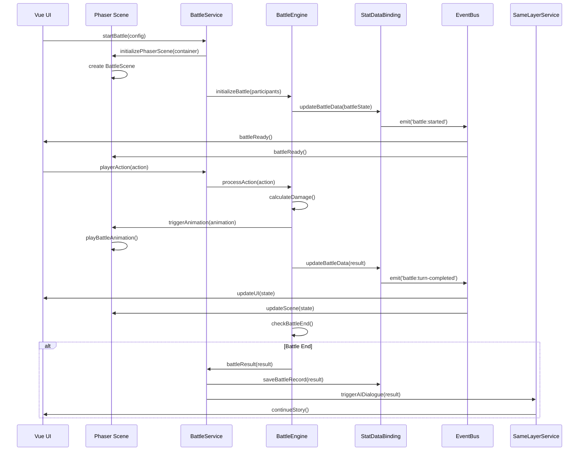

# 基于 Phaser Vue Template 的回合制战斗子系统架构设计（2025-01-24 更新）

## 概述

回合制战斗子系统是同层游玩RPG_remake项目的一个核心功能模块，旨在为玩家提供丰富的战斗体验。该系统基于 Phaser Vue Template 最佳实践构建，与项目现有的混合模式架构（服务层+组合式函数层+Vue组件层）无缝协作，通过 MVU 数据绑定和 AI 集成系统实现完整的战斗流程。

## 设计参考

本架构设计参考了 [Phaser Vue Template](https://github.com/phaserjs/template-vue) 的最佳实践：

- Phaser 3.90.0 + Vue 3.5.13 + Vite 6.3.1
- Vue-Phaser 桥接组件模式
- EventBus 事件通信机制
- 场景生命周期管理

## 设计目标

### 主要目标

1. **Phaser 引擎集成**: 使用 Phaser 3.x 作为核心渲染和游戏逻辑引擎
2. **架构一致性**: 完全遵循项目现有的混合模式架构
3. **MVU集成**: 深度集成MVU变量框架，实现战斗数据的持久化和同步
4. **事件驱动**: 基于EventBus的事件系统，实现战斗流程的协调
5. **AI驱动剧情**: 战斗结果能够智能地推动剧情发展
6. **性能优化**: 利用 Phaser 的渲染优化确保战斗系统的高性能

### 核心特性

- **回合制战斗**: 经典的回合制战斗机制，基于 Phaser 场景管理
- **状态管理**: 完整的战斗状态跟踪和同步，基于MVU变量框架
- **AI集成**: 战斗结果自动触发AI对话，通过SameLayerService实现
- **数据持久化**: 战斗记录和统计数据保存到MVU变量
- **响应式UI**: 基于Vue 3的响应式战斗界面覆盖层
- **游戏引擎渲染**: 基于 Phaser 的高性能2D渲染和动画系统
- **服务健康监控**: 集成到现有的服务健康监控系统

## 整体架构

### 架构层次图（基于 Phaser Vue Template + 现有混合模式架构）

```text
┌─────────────────────────────────────────────────────────────┐
│                    Vue UI 层 (现有)                        │
│  ┌─────────────────┐ ┌─────────────────┐ ┌─────────────────┐ │
│  │   PlayingRoot   │ │   BattleHUD     │ │  ActionPanel    │ │
│  │   BattleDialog  │ │   StatusPanel   │ │  BattleLog      │ │
│  └─────────────────┘ └─────────────────┘ └─────────────────┘ │
└─────────────────────────────────────────────────────────────┘
                              │
                              ▼
┌─────────────────────────────────────────────────────────────┐
│                 Phaser 游戏引擎层 (新增)                   │
│  ┌─────────────────┐ ┌─────────────────┐ ┌─────────────────┐ │
│  │  PhaserGame.vue │ │  BattleScene    │ │  BattleObjects  │ │
│  │  (桥接组件)     │ │  (Phaser场景)   │ │  (游戏对象)     │ │
│  └─────────────────┘ └─────────────────┘ └─────────────────┘ │
└─────────────────────────────────────────────────────────────┘
                              │
                              ▼
┌─────────────────────────────────────────────────────────────┐
│                组合式函数层 (扩展现有)                      │
│  ┌─────────────────┐ ┌─────────────────┐ ┌─────────────────┐ │
│  │ useBattleSystem │ │ usePhaserBattle │ │ useBattleLogic  │ │
│  │ useBattleState  │ │ useBattleEvents │ │ useBattleData   │ │
│  └─────────────────┘ └─────────────────┘ └─────────────────┘ │
└─────────────────────────────────────────────────────────────┘
                              │
                              ▼
┌─────────────────────────────────────────────────────────────┐
│                   服务层 (扩展现有)                        │
│  ┌─────────────────┐ ┌─────────────────┐ ┌─────────────────┐ │
│  │ BattleService   │ │ PhaserManager   │ │ BattleEngine    │ │
│  │ BattleState     │ │ BattleResult    │ │ BattleAI        │ │
│  └─────────────────┘ └─────────────────┘ └─────────────────┘ │
└─────────────────────────────────────────────────────────────┘
                              │
                              ▼
┌─────────────────────────────────────────────────────────────┐
│                   数据层 (现有)                            │
│  ┌─────────────────┐ ┌─────────────────┐ ┌─────────────────┐ │
│  │ MVU变量框架     │ │ StatDataBinding │ │ EventBus        │ │
│  │ 战斗数据模型    │ │ 存档管理        │ │ 同层聊天        │ │
│  └─────────────────┘ └─────────────────┘ └─────────────────┘ │
└─────────────────────────────────────────────────────────────┘
```

### 架构特点

1. **Phaser 引擎核心**: 使用 Phaser 3.x 处理所有游戏对象的渲染、动画、输入和场景管理
2. **Vue UI 覆盖**: Vue 组件作为 UI 覆盖层，管理战斗界面和用户交互
3. **MVU数据绑定**: 所有战斗数据通过MVU变量框架持久化
4. **事件驱动**: 基于EventBus的战斗流程协调，连接 Phaser 场景与 Vue 组件
5. **服务健康监控**: 集成到现有的服务健康监控系统
6. **响应式集成**: Phaser 游戏状态与 Vue 响应式数据的双向同步

## 文件结构规划

```
src/同层游玩RPG_remake/
├── vue/
│   ├── PhaserGame.vue          # 新增：Phaser 桥接组件
│   ├── BattleView.vue          # 新增：战斗主界面
│   ├── BattleHUD.vue           # 新增：战斗UI覆盖层
│   ├── ActionPanel.vue         # 新增：行动面板
│   ├── BattleLog.vue           # 新增：战斗日志
│   ├── StatusPanel.vue         # 新增：状态面板
│   └── BattleResultDialog.vue  # 新增：战斗结果对话框
├── phaser/                     # 新增：Phaser 相关文件
│   ├── scenes/
│   │   ├── BattleScene.ts      # 战斗场景
│   │   └── PreloadScene.ts     # 预加载场景
│   ├── objects/
│   │   ├── BattleParticipant.ts # 战斗参与者对象
│   │   ├── HealthBar.ts        # 生命值条
│   │   └── StatusEffect.ts     # 状态效果
│   ├── managers/
│   │   ├── AnimationManager.ts # 动画管理器
│   │   ├── InputManager.ts     # 输入管理器
│   │   └── ResourceManager.ts  # 资源管理器
│   └── config/
│       └── GameConfig.ts       # Phaser 游戏配置
├── composables/
│   ├── usePhaserBattle.ts      # 新增：Phaser 战斗组合式函数
│   ├── useBattleSystem.ts      # 新增：战斗系统组合式函数
│   └── useBattleUI.ts          # 新增：战斗UI组合式函数
├── services/
│   ├── PhaserManager.ts        # 新增：Phaser 管理服务
│   ├── BattleService.ts        # 新增：战斗服务
│   ├── BattleEngine.ts         # 新增：战斗引擎
│   └── BattleResultHandler.ts  # 新增：战斗结果处理
└── models/
    ├── BattleSchemas.ts        # 新增：战斗数据模型
    └── PhaserTypes.ts          # 新增：Phaser 类型定义
```

## 核心组件设计

### 1. Phaser 桥接组件（基于 Phaser Vue Template）

#### PhaserGame.vue - Vue-Phaser 桥接组件

```vue
<template>
  <div ref="gameContainer" class="phaser-game-container"></div>
</template>

<script setup lang="ts">
import { ref, onMounted, onUnmounted, defineExpose } from 'vue';
import { inject } from 'vue';
import { TYPES } from '../core/ServiceIdentifiers';
import { EventBus } from '../core/EventBus';
import { PhaserManager } from '../services/PhaserManager';

const gameContainer = ref<HTMLElement | null>(null);
const eventBus = inject<EventBus>(TYPES.EventBus);
const phaserManager = inject<PhaserManager>(TYPES.PhaserManager);

let game: Phaser.Game | null = null;
let currentScene: Phaser.Scene | null = null;

const initializePhaser = async () => {
  if (!gameContainer.value || !phaserManager) return;
  
  try {
    game = await phaserManager.initializeGame(gameContainer.value);
    
    // 监听场景变化（参考 Phaser Vue Template）
    game.events.on('scene-ready', (scene: Phaser.Scene) => {
      currentScene = scene;
      eventBus?.emit('current-scene-ready', scene);
    });
    
    eventBus?.emit('phaser:game-ready', game);
  } catch (error) {
    console.error('Phaser 初始化失败:', error);
  }
};

const destroyPhaser = async () => {
  if (game) {
    await phaserManager?.destroyGame();
    game = null;
    currentScene = null;
  }
};

onMounted(() => {
  initializePhaser();
});

onUnmounted(() => {
  destroyPhaser();
});

// 暴露给父组件使用（参考 Phaser Vue Template）
defineExpose({
  game: () => game,
  scene: () => currentScene,
  initializePhaser,
  destroyPhaser
});
</script>
```

### 2. Phaser 游戏引擎层

#### PhaserManager - Phaser 实例管理服务

```typescript
@injectable()
export class PhaserManager {
  private game: Phaser.Game | null = null;
  private battleScene: BattleScene | null = null;
  private eventBus: EventBus;
  private container: HTMLElement | null = null;
  
  constructor(@inject(TYPES.EventBus) eventBus: EventBus) {}
  
  // 核心方法
  async initializePhaser(container: HTMLElement): Promise<void>
  async startBattleScene(config: BattleConfig): Promise<void>
  async destroyPhaser(): Promise<void>
  getBattleScene(): BattleScene | null
  getGame(): Phaser.Game | null
}
```

**职责**:

- Phaser 游戏实例的生命周期管理
- 战斗场景的创建和销毁
- 与 Vue 组件的集成接口
- 资源加载和内存管理

#### BattleScene - 战斗场景（基于 Phaser Vue Template）

```typescript
import { EventBus } from '../core/EventBus';
import { BattleParticipant } from '../objects/BattleParticipant';
import { AnimationManager } from '../managers/AnimationManager';

export class BattleScene extends Phaser.Scene {
  private eventBus: EventBus;
  private participants: Map<string, BattleParticipant> = new Map();
  private animationManager: AnimationManager;
  
  constructor() {
    super({ key: 'BattleScene' });
  }
  
  preload() {
    // 预加载战斗资源
    this.load.image('player-sprite', 'assets/battle/player.png');
    this.load.image('enemy-sprite', 'assets/battle/enemy.png');
    this.load.image('background', 'assets/battle/background.png');
  }
  
  create() {
    // 创建战斗场景
    this.createBackground();
    this.setupEventListeners();
    
    // 通知 Vue 组件场景就绪（参考 Phaser Vue Template）
    this.eventBus.emit('current-scene-ready', this);
  }
  
  private createBackground() {
    this.add.image(0, 0, 'background').setOrigin(0, 0);
  }
  
  private setupEventListeners() {
    // 监听来自 Vue 的事件
    this.eventBus.on('battle:start', this.startBattle, this);
    this.eventBus.on('battle:action', this.processAction, this);
    this.eventBus.on('battle:end', this.endBattle, this);
  }
  
  startBattle(participants: any[]) {
    // 创建战斗参与者
    participants.forEach(participant => {
      const battleObj = new BattleParticipant(this, participant);
      this.participants.set(participant.id, battleObj);
    });
  }
  
  processAction(action: any) {
    // 处理战斗行动
    this.animationManager.playActionAnimation(action);
  }
  
  endBattle(result: any) {
    // 结束战斗
    this.eventBus.emit('battle:result', result);
  }
}
```

**职责**:

- 战斗场景的渲染和管理
- 战斗参与者的游戏对象管理
- 战斗动画和特效的播放
- 用户输入的响应和处理

#### BattleParticipantObject - 战斗参与者游戏对象

```typescript
export class BattleParticipantObject extends Phaser.GameObjects.Container {
  private participantData: BattleParticipant;
  private sprite: Phaser.GameObjects.Sprite;
  private healthBar: Phaser.GameObjects.Graphics;
  private statusEffects: Phaser.GameObjects.Container;
  private animationManager: ParticipantAnimationManager;
  
  constructor(scene: Phaser.Scene, participant: BattleParticipant) {
    super(scene);
    this.participantData = participant;
    this.initializeComponents();
  }
  
  // 组件初始化
  private initializeComponents(): void
  private createSprite(): void
  private createHealthBar(): void
  private createStatusEffects(): void
  
  // 状态更新
  updateHealth(current: number, max: number): void
  updateStatusEffects(effects: StatusEffect[]): void
  playActionAnimation(action: BattleAction): void
  playDamageAnimation(damage: number): void
  playDeathAnimation(): void
}
```

**职责**:

- 单个战斗参与者的视觉表现
- 生命值、状态效果的显示
- 角色动画和特效的播放
- 用户交互的响应

#### BattleAnimationManager - 战斗动画管理器

```typescript
export class BattleAnimationManager {
  private scene: BattleScene;
  private animationQueue: BattleAnimation[] = [];
  private isPlaying: boolean = false;
  
  constructor(scene: BattleScene) {
    this.scene = scene;
  }
  
  // 动画管理
  queueAnimation(animation: BattleAnimation): void
  playAnimationSequence(animations: BattleAnimation[]): Promise<void>
  playDamageAnimation(target: BattleParticipantObject, damage: number): Promise<void>
  playSkillAnimation(caster: BattleParticipantObject, skill: Skill, targets: BattleParticipantObject[]): Promise<void>
  playStatusEffectAnimation(target: BattleParticipantObject, effect: StatusEffect): Promise<void>
  
  // 动画类型
  private createDamageNumberAnimation(damage: number, position: Phaser.Math.Vector2): Phaser.Tweens.Tween
  private createSkillEffectAnimation(skill: Skill, caster: BattleParticipantObject, targets: BattleParticipantObject[]): Promise<void>
  private createParticleEffect(effectType: string, position: Phaser.Math.Vector2): void
}
```

**职责**:

- 战斗动画的队列管理
- 伤害数字、技能特效的播放
- 粒子系统和视觉特效
- 动画时序控制

### 2. 服务层架构（基于现有架构模式）

#### BattleService - 战斗核心服务

```typescript
@injectable()
export class BattleService {
  private battleEngine: BattleEngine;
  private battleState: BattleState | null = null;
  private phaserManager: PhaserManager;
  private statDataBinding: StatDataBindingService;
  private eventBus: EventBus;
  private sameLayerService: SameLayerService;
  
  constructor(
    @inject(TYPES.StatDataBindingService) statDataBinding: StatDataBindingService,
    @inject(TYPES.EventBus) eventBus: EventBus,
    @inject(TYPES.SameLayerService) sameLayerService: SameLayerService,
    @inject(TYPES.BattleEngine) battleEngine: BattleEngine,
    @inject(TYPES.PhaserManager) phaserManager: PhaserManager
  ) {}
  
  // 核心方法
  async initializeBattle(config: BattleConfig): Promise<void>
  async startBattle(participants: BattleParticipant[]): Promise<BattleResult>
  async processPlayerAction(action: BattleAction): Promise<void>
  getBattleState(): BattleState | null
  async endBattle(result: BattleResult): Promise<void>
  
  // Phaser 集成方法
  async initializePhaserScene(container: HTMLElement): Promise<void>
  async updatePhaserScene(state: BattleState): Promise<void>
}
```

**职责**:

- 战斗生命周期管理
- Phaser 场景的协调
- 与MVU变量框架的协调
- 战斗状态的管理和同步
- 与外部系统的接口

#### BattleEngine - 战斗逻辑引擎

```typescript
@injectable()
export class BattleEngine {
  private statDataBinding: StatDataBindingService;
  private eventBus: EventBus;
  
  constructor(
    @inject(TYPES.StatDataBindingService) statDataBinding: StatDataBindingService,
    @inject(TYPES.EventBus) eventBus: EventBus
  ) {}
  
  // 核心逻辑方法
  calculateDamage(attacker: BattleParticipant, target: BattleParticipant, action: BattleAction): number
  processTurn(participants: BattleParticipant[]): BattleTurnResult
  checkBattleEnd(participants: BattleParticipant[]): BattleEndCondition
  applyStatusEffects(participant: BattleParticipant): void
  async updateBattleData(battleState: BattleState): Promise<void>
  
  // 动画协调
  async triggerBattleAnimation(animation: BattleAnimation): Promise<void>
  async processAnimationSequence(animations: BattleAnimation[]): Promise<void>
}
```

**职责**:

- 战斗规则计算
- 回合制逻辑处理
- 状态效果管理
- 战斗结束条件判断
- MVU数据更新
- 动画事件的触发

### 3. 组合式函数层架构（基于现有模式）

#### usePhaserBattle - Phaser 战斗组合式函数（基于 Phaser Vue Template）

```typescript
import { ref, inject, onUnmounted } from 'vue';
import { TYPES } from '../core/ServiceIdentifiers';
import { EventBus } from '../core/EventBus';
import { PhaserManager } from '../services/PhaserManager';

export function usePhaserBattle() {
  const eventBus = inject<EventBus>(TYPES.EventBus);
  const phaserManager = inject<PhaserManager>(TYPES.PhaserManager);
  
  const game = ref<Phaser.Game | null>(null);
  const currentScene = ref<Phaser.Scene | null>(null);
  const isPhaserReady = ref(false);
  
  const initializePhaser = async (container: HTMLElement) => {
    if (!phaserManager) return;
    
    try {
      game.value = await phaserManager.initializeGame(container);
      isPhaserReady.value = true;
      
      // 监听场景就绪事件（参考 Phaser Vue Template）
      eventBus?.on('current-scene-ready', (scene: Phaser.Scene) => {
        currentScene.value = scene;
      });
    } catch (error) {
      console.error('Phaser 初始化失败:', error);
    }
  };
  
  const startBattleScene = async (config: any) => {
    if (!game.value) return;
    
    game.value.scene.start('BattleScene', config);
  };
  
  const destroyPhaser = async () => {
    if (phaserManager) {
      await phaserManager.destroyGame();
      game.value = null;
      currentScene.value = null;
      isPhaserReady.value = false;
    }
  };
  
  onUnmounted(() => {
    destroyPhaser();
  });
  
  return {
    game: readonly(game),
    currentScene: readonly(currentScene),
    isPhaserReady: readonly(isPhaserReady),
    initializePhaser,
    startBattleScene,
    destroyPhaser
  };
}
```

**特性**:

- Phaser 实例的响应式管理
- 战斗场景的生命周期控制
- 与现有服务层的集成
- 类型安全的状态管理

#### useBattleSystem - 战斗系统组合式函数

```typescript
export function useBattleSystem() {
  const battleService = inject<BattleService>(TYPES.BattleService);
  const phaserBattle = usePhaserBattle();
  const eventBus = inject<EventBus>(TYPES.EventBus);
  const statDataBinding = inject<StatDataBindingService>(TYPES.StatDataBindingService);
  
  // 响应式状态
  const battleState = ref<BattleState | null>(null);
  const isInBattle = ref(false);
  const battleResult = ref<BattleResult | null>(null);
  const battleParticipants = ref<BattleParticipant[]>([]);
  
  // 核心方法
  const startBattle = async (config: BattleConfig) => {
    await battleService.initializeBattle(config);
    await phaserBattle.startBattleScene(config);
    isInBattle.value = true;
  };
  
  const processPlayerAction = async (action: BattleAction) => {
    await battleService.processPlayerAction(action);
  };
  
  const endBattle = async (result: BattleResult) => {
    await battleService.endBattle(result);
    isInBattle.value = false;
    battleResult.value = result;
  };
  
  return {
    battleState: readonly(battleState),
    isInBattle: readonly(isInBattle),
    battleResult: readonly(battleResult),
    battleParticipants: readonly(battleParticipants),
    startBattle,
    processPlayerAction,
    endBattle,
    ...phaserBattle
  };
}
```

**特性**:

- 响应式状态管理
- Phaser 与战斗逻辑的集成
- 服务层集成
- 事件处理
- 类型安全

### 4. Vue组件层（基于现有组件模式）

#### PlayingRoot.vue 集成战斗界面（扩展现有组件）

```vue
<template>
  <div class="playing-root">
    <!-- 现有游玩内容 -->
    <div v-if="!isInBattle" class="normal-game-content">
      <!-- 现有的游玩界面内容 -->
    </div>
    
    <!-- 战斗界面（新增） -->
    <div v-if="isInBattle" class="battle-interface">
      <PhaserGame ref="phaserGame" @current-active-scene="onSceneReady" />
      <BattleHUD :participants="battleParticipants" />
      <ActionPanel 
        v-if="isPlayerTurn" 
        :available-actions="availableActions"
        @action-selected="handleAction" 
      />
      <BattleLog :events="battleEvents" />
      <StatusPanel :participants="battleParticipants" />
    </div>
    
    <!-- 战斗结果对话框 -->
    <BattleResultDialog
      v-if="battleResult"
      :result="battleResult"
      @close="handleBattleResultClose"
    />
  </div>
</template>

<script setup lang="ts">
import { ref, computed } from 'vue';
import { usePhaserBattle } from '../composables/usePhaserBattle';
import { useBattleSystem } from '../composables/useBattleSystem';
import { useStatData } from '../composables/useStatData';
import PhaserGame from './PhaserGame.vue';
import BattleHUD from './BattleHUD.vue';
import ActionPanel from './ActionPanel.vue';
import BattleLog from './BattleLog.vue';
import StatusPanel from './StatusPanel.vue';
import BattleResultDialog from './BattleResultDialog.vue';

const phaserGame = ref();

const {
  game,
  currentScene,
  isPhaserReady,
  startBattleScene
} = usePhaserBattle();

const {
  battleState,
  isInBattle,
  battleResult,
  battleParticipants,
  startBattle,
  processPlayerAction
} = useBattleSystem();

const { currentAttributes, equipment } = useStatData();

// 计算属性
const isPlayerTurn = computed(() => battleState.value?.currentTurn === 'player');
const availableActions = computed(() => {
  return calculateAvailableActions(currentAttributes.value, equipment.value);
});

// 方法
const onSceneReady = (scene: Phaser.Scene) => {
  console.log('战斗场景就绪:', scene);
};

const handleAction = async (action: any) => {
  await processPlayerAction(action);
};

const handleBattleResultClose = () => {
  battleResult.value = null;
};
</script>
```

**特性**:

- Phaser 游戏容器的集成
- Vue UI 覆盖层的管理
- 响应式战斗界面
- 用户交互处理
- 战斗结果展示

#### 战斗UI组件

- **BattleHUD**: 生命值、魔法值、状态效果显示（Vue 组件）
- **ActionPanel**: 技能、物品、行动按钮（Vue 组件）
- **BattleLog**: 战斗事件日志（Vue 组件）
- **StatusPanel**: 参与者状态和回合顺序（Vue 组件）
- **BattleResultDialog**: 战斗结果对话框（Vue 组件）

## 数据流架构

### 战斗数据流（基于 Phaser + 现有架构）



### 状态同步机制

1. **Vue → 服务层**: 通过组合式函数调用服务方法
2. **服务层 → Phaser**: 通过 PhaserManager 更新游戏场景
3. **服务层 → MVU**: 通过StatDataBindingService更新MVU变量
4. **MVU → Vue**: 通过MVU事件系统更新响应式数据
5. **Phaser → 服务层**: 通过 EventBus 传递游戏事件
6. **战斗结果 → AI**: 通过SameLayerService触发对话

## Phaser 集成机制

### 场景管理

```typescript
// Phaser 游戏配置
const gameConfig: Phaser.Types.Core.GameConfig = {
  type: Phaser.AUTO,
  width: 1920,
  height: 1080,
  parent: 'phaser-container',
  backgroundColor: '#2c3e50',
  scene: [BattleScene],
  physics: {
    default: 'arcade',
    arcade: {
      gravity: { y: 0 },
      debug: false
    }
  },
  render: {
    antialias: true,
    pixelArt: false
  }
};
```

### 资源管理

```typescript
export class BattleResourceManager {
  private scene: BattleScene;
  private loadedAssets: Map<string, any> = new Map();
  
  constructor(scene: BattleScene) {
    this.scene = scene;
  }
  
  // 预加载战斗资源
  async preloadBattleAssets(): Promise<void> {
    // 角色精灵
    this.scene.load.image('player-sprite', 'assets/battle/player.png');
    this.scene.load.image('enemy-sprite', 'assets/battle/enemy.png');
    
    // 技能特效
    this.scene.load.image('fire-effect', 'assets/battle/fire.png');
    this.scene.load.image('ice-effect', 'assets/battle/ice.png');
    
    // 粒子系统
    this.scene.load.image('particle', 'assets/battle/particle.png');
    
    // 音效
    this.scene.load.audio('battle-bgm', 'assets/audio/battle.mp3');
    this.scene.load.audio('damage-sound', 'assets/audio/damage.wav');
  }
  
  // 获取资源
  getAsset(key: string): any {
    return this.loadedAssets.get(key);
  }
}
```

### 动画系统

```typescript
export class PhaserAnimationSystem {
  private scene: BattleScene;
  private tweens: Map<string, Phaser.Tweens.Tween> = new Map();
  
  constructor(scene: BattleScene) {
    this.scene = scene;
  }
  
  // 伤害数字动画
  createDamageAnimation(damage: number, position: Phaser.Math.Vector2): Phaser.Tweens.Tween {
    const damageText = this.scene.add.text(position.x, position.y, damage.toString(), {
      fontSize: '32px',
      color: damage > 0 ? '#ff4444' : '#44ff44',
      stroke: '#000000',
      strokeThickness: 2
    });
    
    return this.scene.tweens.add({
      targets: damageText,
      y: position.y - 100,
      alpha: 0,
      duration: 2000,
      ease: 'Power2',
      onComplete: () => damageText.destroy()
    });
  }
  
  // 技能特效动画
  createSkillEffectAnimation(skill: Skill, caster: BattleParticipantObject, targets: BattleParticipantObject[]): Promise<void> {
    return new Promise((resolve) => {
      // 创建技能特效精灵
      const effectSprite = this.scene.add.sprite(caster.x, caster.y, skill.effectTexture);
      
      // 播放技能动画
      this.scene.tweens.add({
        targets: effectSprite,
        scaleX: 2,
        scaleY: 2,
        alpha: 0,
        duration: 1000,
        ease: 'Power2',
        onComplete: () => {
          effectSprite.destroy();
          resolve();
        }
      });
    });
  }
  
  // 粒子特效
  createParticleEffect(effectType: string, position: Phaser.Math.Vector2): void {
    const particles = this.scene.add.particles(position.x, position.y, 'particle', {
      speed: { min: 50, max: 150 },
      scale: { start: 1, end: 0 },
      lifespan: 1000,
      quantity: 20
    });
    
    particles.explode(20);
  }
}
```

## AI集成机制

### 战斗结果处理流程

1. **结果收集**: 收集战斗中的所有关键事件和数据
2. **总结生成**: 自动生成战斗总结文本
3. **数据更新**: 更新角色属性和物品
4. **世界书更新**: 将战斗记录添加到世界书
5. **AI对话**: 触发AI生成后续剧情
6. **剧情继续**: 通过同层聊天系统继续故事

### 战斗结果处理服务

```typescript
@injectable()
export class BattleResultHandler {
  private statDataBinding: StatDataBindingService;
  private sameLayerService: SameLayerService;
  private eventBus: EventBus;
  
  constructor(
    @inject(TYPES.StatDataBindingService) statDataBinding: StatDataBindingService,
    @inject(TYPES.SameLayerService) sameLayerService: SameLayerService,
    @inject(TYPES.EventBus) eventBus: EventBus
  ) {}
  
  async handleBattleResult(result: BattleResult): Promise<void> {
    // 1. 更新角色数据
    await this.updateCharacterData(result);
    
    // 2. 保存战斗记录
    await this.saveBattleRecord(result);
    
    // 3. 生成战斗总结
    const summary = await this.generateBattleSummary(result);
    
    // 4. 触发AI对话
    await this.triggerAIDialogue(summary, result);
  }
  
  private async triggerAIDialogue(summary: string, result: BattleResult): Promise<void> {
    const context = {
      battleSummary: summary,
      battleResult: result,
      characterData: await this.statDataBinding.getStatData(),
      timestamp: new Date().toISOString()
    };
    
    await this.sameLayerService.generate({
      user_input: `战斗结束，结果：${summary}`,
      context: context
    });
  }
}
```

## 集成点

### 与现有系统的集成

1. **服务容器**: 通过ServiceLocator注册所有战斗服务
2. **事件系统**: 使用EventBus进行组件间通信
3. **状态管理**: 与Pinia store集成，管理战斗状态
4. **MVU变量**: 通过StatDataBindingService同步数据
5. **同层聊天**: 通过SameLayerService触发AI对话
6. **存档管理**: 通过SaveLoadManagerService保存战斗记录
7. **Phaser 集成**: 通过 PhaserManager 管理游戏引擎

### 触发机制

- 通过事件`battle:start`触发战斗开始
- 通过事件`battle:phaser-ready`通知 Phaser 场景就绪
- 通过事件`battle:animation-complete`通知动画完成
- 通过事件`battle:completed`处理战斗结束
- 通过事件`battle:result-processed`继续剧情

### 服务注册

```typescript
// 在ServiceIdentifiers.ts中添加
export const TYPES = {
  // ... 现有服务
  BattleService: Symbol.for('BattleService'),
  BattleEngine: Symbol.for('BattleEngine'),
  BattleResultHandler: Symbol.for('BattleResultHandler'),
  PhaserManager: Symbol.for('PhaserManager'),
  BattleAnimationManager: Symbol.for('BattleAnimationManager'),
} as const;
```

### 服务初始化

```typescript
// 在GameCoreFactory中添加战斗服务初始化
export class GameCoreFactory {
  // ... 现有初始化方法
  
  private async initializeBattleServices(): Promise<void> {
    // 注册战斗服务
    this.container.bind<BattleService>(TYPES.BattleService).to(BattleService);
    this.container.bind<BattleEngine>(TYPES.BattleEngine).to(BattleEngine);
    this.container.bind<BattleResultHandler>(TYPES.BattleResultHandler).to(BattleResultHandler);
    this.container.bind<PhaserManager>(TYPES.PhaserManager).to(PhaserManager);
    this.container.bind<BattleAnimationManager>(TYPES.BattleAnimationManager).to(BattleAnimationManager);
  }
}
```

## 性能优化策略

### Phaser 渲染优化

- **对象池**: 使用 Phaser 的对象池管理游戏对象
- **纹理图集**: 使用纹理图集减少绘制调用
- **批处理**: 利用 Phaser 的批处理系统
- **视锥剔除**: 只渲染可见区域的游戏对象
- **LOD系统**: 根据距离调整细节层次

### 内存管理

- **资源预加载**: 战斗开始前预加载所有资源
- **动态卸载**: 战斗结束后卸载不需要的资源
- **对象复用**: 复用游戏对象减少内存分配
- **事件清理**: 正确清理事件监听器

### 数据优化

- **增量更新**: 只更新变化的战斗状态
- **MVU缓存**: 利用MVU变量的缓存机制
- **事件压缩**: 压缩事件数据减少传输
- **服务监控**: 集成服务健康监控

## 扩展性设计

### 战斗类型扩展

- **不同战斗规则**: 支持PVP、PVE、团队战等
- **可配置参数**: 基于MVU变量的战斗配置
- **自定义技能**: 可扩展的技能和物品系统
- **场景变化**: 支持不同的战斗场景

### Phaser 功能扩展

- **3D效果**: 使用 Phaser 3D 插件
- **物理引擎**: 集成更复杂的物理系统
- **音效系统**: 完整的音效和背景音乐
- **多平台支持**: 支持移动端和桌面端

### AI集成扩展

- **多模型支持**: 支持不同的AI模型
- **对话模板**: 可配置的对话模板
- **多语言**: 多语言支持
- **智能决策**: AI参与战斗决策

## 集成方案

### 1. 服务层集成

```typescript
// 在 ServiceIdentifiers.ts 中添加
export const TYPES = {
  // ... 现有服务
  PhaserManager: Symbol.for('PhaserManager'),
  BattleService: Symbol.for('BattleService'),
  BattleEngine: Symbol.for('BattleEngine'),
  BattleResultHandler: Symbol.for('BattleResultHandler'),
} as const;
```

### 2. GameCoreFactory 集成

```typescript
// 在 GameCoreFactory.ts 中添加战斗服务初始化
private static async initializeBattleServices(): Promise<void> {
  // 注册战斗服务
  serviceContainer.bind<PhaserManager>(TYPES.PhaserManager).to(PhaserManager);
  serviceContainer.bind<BattleService>(TYPES.BattleService).to(BattleService);
  serviceContainer.bind<BattleEngine>(TYPES.BattleEngine).to(BattleEngine);
  serviceContainer.bind<BattleResultHandler>(TYPES.BattleResultHandler).to(BattleResultHandler);
}
```

### 3. 事件通信机制（基于现有 EventBus）

```typescript
// Vue 到 Phaser
eventBus.emit('battle:start', battleConfig);
eventBus.emit('battle:action', playerAction);

// Phaser 到 Vue
eventBus.emit('battle:result', battleResult);
eventBus.emit('current-scene-ready', scene);
```

## 现实实现对齐与补充

### 实际文件结构（与当前代码一致）

```
src/同层游玩RPG_remake/
├── phaser/
│   ├── scenes/
│   │   └── BattleScene.ts
│   └── objects/
│       ├── PlayerBattleObject.ts
│       └── EnemyBattleObject.ts
├── configs/
│   └── battle/
│       └── basicBattles.ts
├── composables/
│   ├── useBattleSystem.ts
│   ├── usePhaserBattle.ts
│   ├── useBattleState.ts
│   ├── useBattleConfig.ts
│   ├── useBattleAnimation.ts
│   ├── useGameStateManager.ts
│   ├── useCommandQueue.ts
│   └── useStatData.ts
└── vue/components/
    ├── PhaserGame.vue
    ├── BattleLayout.vue
    ├── BattleTopHUD.vue
    ├── BattleBottomHUD.vue
    ├── PlayerStatusPanel.vue
    ├── EnemyStatusPanel.vue
    ├── BattleStatusIndicator.vue
    ├── BattleCenterArea.vue
    ├── ActionWheel.vue
    ├── BattleActionPanel.vue
    ├── BattleHealthBar.vue
    ├── BattleInfo.vue
    ├── BattleUI.vue
    ├── BattleResultDialog.vue
    └── BattleUITest.vue
```

说明：原文档中的占位对象名如 `BattleParticipantObject`、`HealthBar.ts`、`StatusEffect.ts` 在当前实现中对应为 `PlayerBattleObject.ts`、`EnemyBattleObject.ts` 等具体文件；`PreloadScene.ts`、`managers/*`、`config/GameConfig.ts` 暂未落地（可作为后续扩展）。

### 组合式函数补充

- `useBattleSystem`（战斗编排器）
  - 统一启动/行动/结束与事件绑定：监听 `battle:initialized`、`battle:ended`；调用 `useGameStateManager` 切换战斗态；在 `nextTick()` 后启动 Phaser 场景。
  - 流程（精简）：Service.initializeBattle → useBattleState.initializeBattle → nextTick → Service.startBattle(currentState, processedConfig)。
- `usePhaserBattle`：管理 Phaser 实例与场景生命周期，暴露 `startBattleScene` 供编排器调用。
- `useBattleState`：承载战斗状态、回合数、胜负标记，订阅事件总线以响应状态变更。
- `useBattleConfig`：解析/校验战斗配置，负责 MVU 属性到战斗初始值的映射规则（落在组合式或服务层均可）。
- `useBattleAnimation`：抽象 UI/Phaser 动画触发与时序（当前阶段可最小实现，计划由动画管理器增强）。
- `useCommandQueue`：桥接 `CommandQueueService`，提供装备/背包/属性等便捷 API 与执行前置钩子（监听 `command-queue:*` 事件以反馈执行状态）。

### 服务与配置补充

- `BattleConfigService`：战斗配置模型与校验、基于难度/标签的配置选择。
- `BattleResourceService`：背景/立绘/示例资源 URL 提供与预加载策略（`basicBattles.ts` 使用其示例 URL）。
- `CommandQueueService`：队列管理、批量执行、性能统计与错误日志；通过事件总线对外广播执行态。

建议在 `TYPES` 中补充：

```ts
export const TYPES = {
  // ... 现有服务
  BattleService: Symbol.for('BattleService'),
  BattleEngine: Symbol.for('BattleEngine'),
  BattleResultHandler: Symbol.for('BattleResultHandler'),
  PhaserManager: Symbol.for('PhaserManager'),
  BattleAnimationManager: Symbol.for('BattleAnimationManager'),
  CommandQueueService: Symbol.for('CommandQueueService'),
  BattleConfigService: Symbol.for('BattleConfigService'),
  BattleResourceService: Symbol.for('BattleResourceService'),
} as const;
```

### 配置与数据模型扩展（`configs/battle/basicBattles.ts`）

- 背景：`background.image`、`background.scaleMode` (`contain|cover`)、`background.parallax.layers[]`（`image|speed|depth`）。
- 参与者：
  - `mvuAttributes`：如 力量/敏捷/防御/体质/魅力/幸运/意志（例如 hp = 体质×20，hhp = 意志/50，具体映射由数据绑定/配置层实现）。
  - 敌方立绘 `enemyPortrait`：`image`、`position{x,y,scale}`、`animation{idle,attack,damage}`、`videos[skillKey]`（含 `loop|volume|playbackRate|revertOnEnd|offsetX|offsetY|vScale` 可选项）。

### 事件与生命周期（对齐现实现）

- 战斗主流程事件：
  - `battle:initialized`（Service 初始化完成 → 编排器初始化状态并启动场景）
  - `battle:ended`（引擎判定结束 → 编排器退出战斗并结算）
- 命令队列事件（window 级 EventBus，供 UI 反馈）：
  - `command-queue:executing`、`command-queue:executed`、`command-queue:error`
- 现有桥接事件：`current-scene-ready`、`battle:action`、`battle:result` 等。

### 与 Playing 层集成

- 通过 `useGameStateManager` 的 `isInBattle` 控制战斗界面显隐；在 `useBattleSystem` 的开始/结束处理时分别进入/退出战斗态。

## 开发计划

### 第一阶段：Phaser 基础集成（1-2周）

- 创建 PhaserGame.vue 桥接组件
- 实现 PhaserManager 服务
- 创建基础 BattleScene
- 集成到现有的服务容器中

### 第二阶段：战斗系统（2-3周）

- 实现 BattleService 和 BattleEngine
- 创建战斗相关的组合式函数
- 实现战斗UI组件
- 集成到现有的游戏流程

### 第三阶段：动画和特效（2-3周）

- 实现动画管理器
- 创建战斗对象和特效
- 优化渲染性能
- 完善用户体验

### 第四阶段：测试和优化（1-2周）

- 全面测试战斗系统
- 性能优化
- 错误处理完善
- 文档更新

## 技术债务和风险

### 技术风险

- **Phaser 学习曲线**: 团队需要学习 Phaser 3.x
- **内存管理**: Phaser 游戏对象需要正确管理
- **性能优化**: 需要优化 Phaser 渲染性能
- **集成复杂性**: Phaser 与现有架构的集成

### 缓解措施

- **渐进式开发**: 分阶段实现功能
- **充分测试**: 全面的测试覆盖
- **性能监控**: 集成性能监控系统
- **文档完善**: 详细的开发文档

## 总结

基于 Phaser Vue Template 的回合制战斗子系统是一个功能强大且设计良好的模块，它充分利用了 Phaser 游戏引擎的能力，同时完全基于现有的项目架构。通过参考 Phaser Vue Template 的最佳实践，实现了：

### 核心优势

1. **完全兼容现有架构**: 基于现有的服务层+组合式函数层+Vue组件层架构
2. **Phaser Vue Template 最佳实践**: 使用成熟的 Vue-Phaser 桥接模式
3. **EventBus 事件通信**: 利用现有的 EventBus 实现组件间通信
4. **渐进式集成**: 可以逐步添加战斗功能，不影响现有功能
5. **类型安全**: 完整的 TypeScript 类型支持

### 技术特点

- **Phaser 3.90.0 + Vue 3.5.13**: 使用最新的技术栈
- **桥接组件模式**: PhaserGame.vue 作为 Vue 和 Phaser 的桥梁
- **场景生命周期管理**: 基于 Phaser Vue Template 的场景管理
- **响应式集成**: Phaser 游戏状态与 Vue 响应式数据的双向同步
- **服务层集成**: 完全集成到现有的依赖注入容器

该系统的设计遵循了项目的架构原则，保持了良好的模块化和可扩展性，为未来的功能扩展奠定了坚实的基础。通过 Phaser Vue Template 的成熟模式，确保了系统的稳定性和可维护性。
