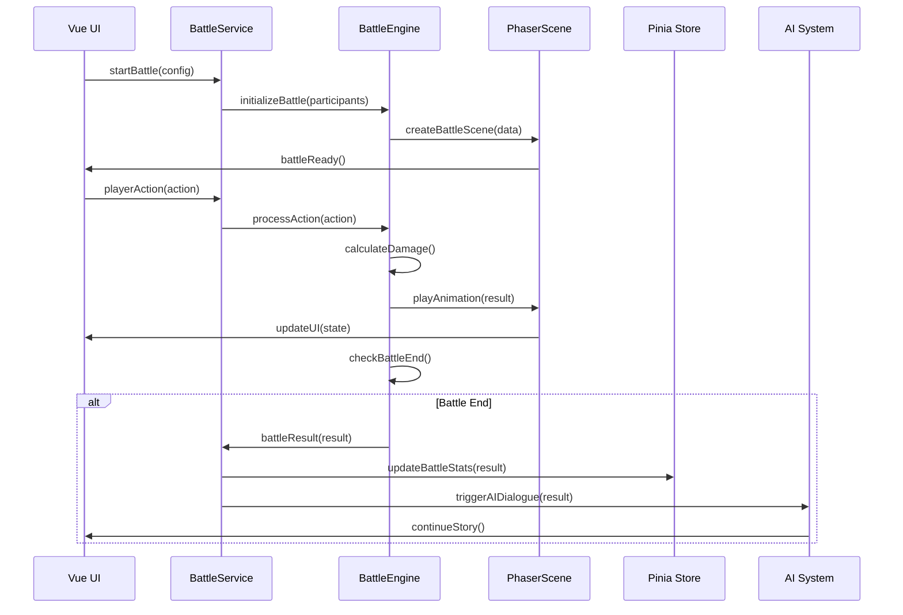

# 回合制战斗子系统架构设计

## 概述

回合制战斗子系统是同层游玩RPG_remake项目的一个核心功能模块，旨在为玩家提供丰富的战斗体验。该系统采用Phaser游戏引擎作为渲染核心，与现有的Vue组件系统、服务层架构和AI集成系统无缝协作。

## 设计目标

### 主要目标

1. **沉浸式战斗体验**: 提供流畅的动画效果和直观的UI交互
2. **无缝集成**: 与现有架构完美融合，不影响主游戏流程
3. **AI驱动剧情**: 战斗结果能够智能地推动剧情发展
4. **可扩展性**: 支持多种战斗类型和自定义规则
5. **性能优化**: 确保战斗系统不影响整体游戏性能

### 核心特性

- **回合制战斗**: 经典的回合制战斗机制
- **动画系统**: 丰富的战斗动画和特效
- **状态管理**: 完整的战斗状态跟踪和同步
- **AI集成**: 战斗结果自动触发AI对话
- **数据持久化**: 战斗记录和统计数据保存

## 整体架构

### 架构层次图

```
┌─────────────────────────────────────────────────────────────┐
│                    Vue组件层                                │
│  ┌─────────────┐  ┌─────────────┐  ┌─────────────┐        │
│  │ BattleView  │  │ BattleHUD   │  │ ActionPanel │        │
│  └─────────────┘  └─────────────┘  └─────────────┘        │
└─────────────────────────────────────────────────────────────┘
┌─────────────────────────────────────────────────────────────┐
│                   Composable层                              │
│  ┌─────────────┐  ┌─────────────┐  ┌─────────────┐        │
│  │useBattleSys │  │useBattleUI  │  │useBattleAnim│        │
│  └─────────────┘  └─────────────┘  └─────────────┘        │
└─────────────────────────────────────────────────────────────┘
┌─────────────────────────────────────────────────────────────┐
│                   服务层                                    │
│  ┌─────────────┐  ┌─────────────┐  ┌─────────────┐        │
│  │BattleService│  │BattleEngine │  │BattleResult │        │
│  └─────────────┘  └─────────────┘  └─────────────┘        │
└─────────────────────────────────────────────────────────────┘
┌─────────────────────────────────────────────────────────────┐
│                  Phaser游戏层                               │
│  ┌─────────────┐  ┌─────────────┐  ┌─────────────┐        │
│  │PhaserManager│  │BattleScene  │  │AnimationMgr │        │
│  └─────────────┘  └─────────────┘  └─────────────┘        │
└─────────────────────────────────────────────────────────────┘
┌─────────────────────────────────────────────────────────────┐
│                   数据层                                    │
│  ┌─────────────┐  ┌─────────────┐  ┌─────────────┐        │
│  │BattleState  │  │BattleModels │  │MVU集成      │        │
│  └─────────────┘  └─────────────┘  └─────────────┘        │
└─────────────────────────────────────────────────────────────┘
```

## 核心组件设计

### 1. 服务层架构

#### BattleService - 战斗核心服务

```typescript
@injectable()
export class BattleService {
  private phaserManager: PhaserBattleManager;
  private battleEngine: BattleEngine;
  private battleState: BattleState | null = null;
  
  // 核心方法
  async initializeBattle(config: BattleConfig): Promise<void>
  async startBattle(participants: BattleParticipant[]): Promise<BattleResult>
  async processPlayerAction(action: BattleAction): Promise<void>
  getBattleState(): BattleState | null
  async endBattle(result: BattleResult): Promise<void>
}
```

**职责**:

- 战斗生命周期管理
- 与Phaser游戏引擎的协调
- 战斗状态的管理和同步
- 与外部系统的接口

#### BattleEngine - 战斗逻辑引擎

```typescript
export class BattleEngine {
  // 核心逻辑方法
  calculateDamage(attacker: BattleParticipant, target: BattleParticipant, action: BattleAction): number
  processTurn(participants: BattleParticipant[]): BattleTurnResult
  checkBattleEnd(participants: BattleParticipant[]): BattleEndCondition
  applyStatusEffects(participant: BattleParticipant): void
}
```

**职责**:

- 战斗规则计算
- 回合制逻辑处理
- 状态效果管理
- 战斗结束条件判断

#### BattleResultHandler - 战斗结果处理

```typescript
@injectable()
export class BattleResultHandler {
  // 结果处理方法
  async handleBattleResult(result: BattleResult): Promise<void>
  private async generateBattleSummary(result: BattleResult): Promise<string>
  private async triggerAIDialogue(summary: string, result: BattleResult): Promise<void>
  private async updateCharacterData(result: BattleResult): Promise<void>
}
```

**职责**:

- 战斗结果处理
- AI对话触发
- 角色数据更新
- 世界书集成

### 2. Phaser游戏引擎集成

#### PhaserBattleManager - Phaser管理器

```typescript
export class PhaserBattleManager {
  private game: Phaser.Game | null = null;
  private battleScene: BattleScene | null = null;
  
  // 核心方法
  async initialize(container: HTMLElement): Promise<void>
  startBattle(battleData: BattleData): void
  handlePlayerInput(input: BattleInput): void
  destroy(): void
}
```

**特性**:

- 动态初始化和销毁
- 响应式画布大小调整
- 与Vue组件的无缝集成
- 资源管理和内存优化

#### BattleScene - 战斗场景

```typescript
export class BattleScene extends Phaser.Scene {
  private participants: Map<string, BattleParticipantSprite> = new Map();
  private battleUI: BattleUIManager;
  private animationManager: BattleAnimationManager;
  
  // 场景方法
  create(): void
  initializeBattle(battleData: BattleData): void
  processTurn(turnData: TurnData): void
  playBattleAnimation(animation: BattleAnimation): void
}
```

**特性**:

- 参与者精灵管理
- 战斗UI渲染
- 动画系统集成
- 输入处理

### 3. Vue组件层

#### BattleView.vue - 战斗主界面

```vue
<template>
  <div class="battle-view">
    <!-- Phaser游戏容器 -->
    <div ref="phaserContainer" class="phaser-container"></div>
    
    <!-- 战斗UI覆盖层 -->
    <div v-if="isInBattle" class="battle-overlay">
      <BattleHUD :participants="battleState.participants" />
      <ActionPanel v-if="isPlayerTurn" @action-selected="handlePlayerAction" />
      <BattleLog :events="battleState.events" />
      <StatusPanel :participants="battleState.participants" />
    </div>
  </div>
</template>
```

**特性**:

- Phaser游戏容器管理
- 响应式UI覆盖层
- 战斗状态显示
- 用户交互处理

#### 战斗UI组件

- **BattleHUD**: 生命值、魔法值、状态效果显示
- **ActionPanel**: 技能、物品、行动按钮
- **BattleLog**: 战斗事件日志
- **StatusPanel**: 参与者状态和回合顺序

### 4. Composable层

#### useBattleSystem - 战斗系统组合式函数

```typescript
export function useBattleSystem() {
  const battleService = inject<BattleService>('battle');
  const eventBus = inject<EventBus>('eventBus');
  const gameStore = useGameStore();
  
  // 响应式状态
  const battleState = ref<BattleState>(initialBattleState);
  const isInBattle = ref(false);
  const battleResult = ref<BattleResult | null>(null);
  
  // 核心方法
  const startBattle = async (config: BattleConfig) => { /* ... */ };
  const handleBattleResult = (result: BattleResult) => { /* ... */ };
  
  return {
    battleState: readonly(battleState),
    isInBattle: readonly(isInBattle),
    battleResult: readonly(battleResult),
    startBattle,
    handleBattleResult
  };
}
```

**特性**:

- 响应式状态管理
- 服务层集成
- 事件处理
- 类型安全

## 数据流架构

### 战斗数据流



### 状态同步机制

1. **Vue → Phaser**: 通过BattleService传递战斗配置和状态
2. **Phaser → Vue**: 通过事件系统更新UI状态
3. **服务层 → 数据层**: 通过MVU变量系统同步数据
4. **战斗结果 → AI**: 通过TavernGenerationService触发对话

## AI集成机制

### 战斗结果处理流程

1. **结果收集**: 收集战斗中的所有关键事件和数据
2. **总结生成**: 自动生成战斗总结文本
3. **数据更新**: 更新角色属性和物品
4. **世界书更新**: 将战斗记录添加到世界书
5. **AI对话**: 触发AI生成后续剧情
6. **剧情继续**: 通过同层聊天系统继续故事

### AI上下文构建

```typescript
interface AIContext {
  character: CharacterData;
  world: WorldData;
  battleResult: BattleResult;
  timestamp: string;
  gameState: 'post-battle';
}
```

## 动画系统设计

### 动画管理器

```typescript
export class BattleAnimationManager {
  private animations: Map<string, BattleAnimation> = new Map();
  private animationQueue: BattleAnimation[] = [];
  
  // 核心方法
  registerAnimation(id: string, animation: BattleAnimation): void
  async play(animationId: string, context: AnimationContext): Promise<void>
  private async processAnimationQueue(): Promise<void>
}
```

### 动画类型

- **伤害动画**: 数字飘动、血条变化、受击效果
- **治疗动画**: 绿色数字、治疗光效
- **技能动画**: 特效播放、粒子系统
- **状态动画**: 状态图标、持续效果
- **移动动画**: 角色移动、位置变化

## 错误处理和恢复

### 错误类型

1. **初始化错误**: Phaser游戏初始化失败
2. **动画错误**: 动画播放失败
3. **数据同步错误**: MVU变量同步失败
4. **AI集成错误**: AI对话生成失败

### 恢复机制

- **降级处理**: 动画失败时跳过动画继续战斗
- **重试机制**: 数据同步失败时自动重试
- **回退方案**: AI失败时使用默认剧情
- **用户提示**: 清晰的错误信息和操作指导

## 性能优化策略

### 内存管理

- Phaser游戏实例的动态创建和销毁
- 动画资源的按需加载和释放
- 事件监听器的正确清理

### 渲染优化

- 动画队列管理，避免同时播放过多动画
- 精灵对象的对象池复用
- 批量更新UI状态

### 数据优化

- 战斗状态的增量更新
- 事件数据的压缩存储
- 缓存机制减少重复计算

## 扩展性设计

### 战斗类型扩展

- 支持不同的战斗规则（PVP、PVE、团队战）
- 可配置的战斗参数和平衡性
- 自定义技能和物品系统

### 动画系统扩展

- 插件化的动画效果
- 自定义粒子系统
- 音效和背景音乐集成

### AI集成扩展

- 支持不同的AI模型
- 可配置的对话模板
- 多语言支持

## 集成点

### 与现有系统的集成

1. **服务容器**: 通过ServiceLocator注册所有战斗服务
2. **事件系统**: 使用EventBus进行组件间通信
3. **状态管理**: 与Pinia store集成，管理战斗状态
4. **MVU变量**: 通过StatDataBindingService同步数据
5. **同层聊天**: 通过SameLayerService触发AI对话
6. **世界书**: 通过WorldbookSaveService保存战斗记录

### 触发机制

- 通过事件`battle:start`触发战斗开始
- 通过事件`battle:completed`处理战斗结束
- 通过事件`battle:result-processed`继续剧情

## 开发计划

### 第一阶段：基础架构（1-2周）

- 实现BattleService和BattleEngine
- 创建基础的数据模型
- 集成到现有的服务容器中

### 第二阶段：Phaser集成（2-3周）

- 安装和配置Phaser
- 创建基础的战斗场景
- 实现简单的回合制逻辑

### 第三阶段：UI和动画（2-3周）

- 创建战斗UI组件
- 实现战斗动画系统
- 优化用户体验

### 第四阶段：AI集成（1-2周）

- 实现战斗结果处理
- 集成到同层聊天系统
- 测试完整的战斗流程

### 第五阶段：优化和扩展（1-2周）

- 性能优化
- 错误处理完善
- 功能扩展和测试

## 技术债务和风险

### 技术风险

- **Phaser版本兼容性**: 需要确保Phaser版本与项目兼容
- **内存泄漏**: Phaser游戏实例需要正确管理
- **性能影响**: 战斗系统可能影响整体性能

### 缓解措施

- 充分的测试覆盖
- 渐进式集成和回退机制
- 性能监控和优化

## 总结

回合制战斗子系统是一个复杂但设计良好的功能模块，它充分利用了现有项目的架构优势，通过Phaser游戏引擎提供了丰富的视觉体验，同时与AI系统深度集成，为玩家提供了沉浸式的战斗体验。

该系统的设计遵循了项目的架构原则，保持了良好的模块化和可扩展性，为未来的功能扩展奠定了坚实的基础。
