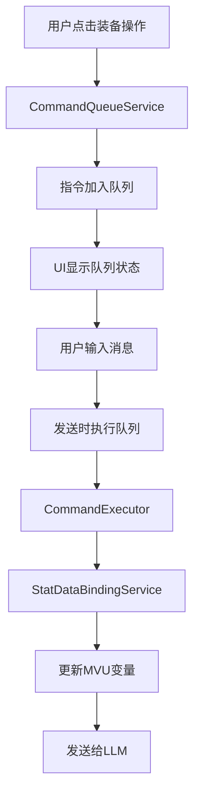

# 指令队列系统设计方案（同层游玩RPG_remake）

## 项目背景

### 需求描述

用户希望在装备栏点击"卸下武器"等操作时，不立即执行操作，而是将操作暂存到指令队列中。在用户下次输入消息并发送时，系统先执行队列中的所有指令（更新MVU变量），然后将更新后的MVU变量和用户输入一起发送给LLM。

### 核心价值

- **批量操作**: 允许用户一次性执行多个装备操作
- **延迟执行**: 操作暂存，与用户输入一起发送
- **MVU同步**: 确保操作后的MVU变量变化能正确传递给LLM
- **用户体验**: 类似购物车的操作体验

## 系统架构设计

### 1. 整体架构



### 2. 核心组件

#### 2.1 CommandQueueService

- **职责**: 指令队列的核心管理服务
- **功能**:
  - 指令的增删改查
  - 队列状态管理
  - 事件通知
  - 持久化支持

#### 2.2 CommandExecutor

- **职责**: 指令执行器
- **功能**:
  - 映射指令到StatDataBindingService方法
  - 批量执行指令
  - 错误处理和回滚
  - 执行结果反馈

#### 2.3 QueueUI

- **职责**: 队列显示组件
- **功能**:
  - 显示待执行指令列表
  - 提供队列操作界面
  - 集成到装备栏

## 详细设计

### 1. 数据结构设计

#### 1.1 指令类型定义

```typescript
// 指令类型枚举
enum CommandType {
  EQUIP = 'equip',           // 装备物品
  UNEQUIP = 'unequip',       // 卸下装备
  ATTRIBUTE = 'attribute',   // 属性修改
  INVENTORY = 'inventory',   // 背包操作
  SKILL = 'skill',          // 技能使用
  ITEM_USE = 'item_use'     // 物品使用
}

// 指令接口
interface Command {
  id: string;                    // 唯一标识
  type: CommandType;             // 指令类型
  action: string;                // 具体操作名称
  params: Record<string, any>;   // 操作参数
  description: string;           // 用户友好的描述
  timestamp: number;             // 创建时间
  priority?: number;             // 优先级（可选）
  dependencies?: string[];       // 依赖的指令ID（可选）
}

// 队列状态
interface QueueState {
  commands: Command[];           // 指令列表
  maxSize: number;              // 最大队列长度
  isExecuting: boolean;         // 是否正在执行
  lastExecuted: number;         // 最后执行时间
}
```

#### 1.2 指令映射表

```typescript
// 指令到StatDataBindingService方法的映射
const COMMAND_MAPPING = {
  // 装备相关
  'equip.weapon': 'equipWeapon',
  'equip.armor': 'equipArmor', 
  'equip.accessory': 'equipAccessory',
  'unequip.weapon': 'unequipWeapon',
  'unequip.armor': 'unequipArmor',
  'unequip.accessory': 'unequipAccessory',
  
  // 属性相关
  'attribute.set': 'setBaseAttribute',
  'attribute.update': 'updateBaseAttributes',
  
  // 背包相关
  'inventory.add': 'addToInventory',
  'inventory.remove': 'removeFromInventory',
  'inventory.clear': 'clearInventoryType'
};
```

### 2. 服务实现

#### 2.1 CommandQueueService

```typescript
@injectable()
export class CommandQueueService {
  private queue: Command[] = [];
  private maxSize: number = 10;
  private isExecuting: boolean = false;
  private eventBus: EventBus;
  private statDataBinding: StatDataBindingService;
  
  constructor(
    @inject(TYPES.EventBus) eventBus: EventBus,
    @inject(TYPES.StatDataBindingService) statDataBinding: StatDataBindingService
  ) {
    this.eventBus = eventBus;
    this.statDataBinding = statDataBinding;
  }
  
  // 添加指令到队列
  addCommand(command: Omit<Command, 'id' | 'timestamp'>): boolean {
    if (this.queue.length >= this.maxSize) {
      console.warn('[CommandQueue] 队列已满，无法添加新指令');
      return false;
    }
    
    const newCommand: Command = {
      ...command,
      id: this.generateId(),
      timestamp: Date.now()
    };
    
    this.queue.push(newCommand);
    this.eventBus.emit('command-queue:added', newCommand);
    return true;
  }
  
  // 移除指令
  removeCommand(id: string): boolean {
    const index = this.queue.findIndex(cmd => cmd.id === id);
    if (index === -1) return false;
    
    const removed = this.queue.splice(index, 1)[0];
    this.eventBus.emit('command-queue:removed', removed);
    return true;
  }
  
  // 清空队列
  clearQueue(): void {
    const cleared = [...this.queue];
    this.queue = [];
    this.eventBus.emit('command-queue:cleared', cleared);
  }
  
  // 执行所有指令
  async executeAll(): Promise<boolean> {
    if (this.isExecuting || this.queue.length === 0) {
      return false;
    }
    
    this.isExecuting = true;
    this.eventBus.emit('command-queue:executing', this.queue);
    
    try {
      const executor = new CommandExecutor(this.statDataBinding);
      const results = await executor.executeBatch(this.queue);
      
      // 清空已执行的指令
      this.queue = [];
      this.eventBus.emit('command-queue:executed', results);
      
      return results.every(r => r.success);
    } catch (error) {
      console.error('[CommandQueue] 执行指令失败:', error);
      this.eventBus.emit('command-queue:error', error);
      return false;
    } finally {
      this.isExecuting = false;
    }
  }
  
  // 获取队列状态
  getQueue(): Command[] {
    return [...this.queue];
  }
  
  // 获取队列长度
  getQueueLength(): number {
    return this.queue.length;
  }
  
  // 检查队列是否为空
  isEmpty(): boolean {
    return this.queue.length === 0;
  }
  
  // 生成唯一ID
  private generateId(): string {
    return `cmd_${Date.now()}_${Math.random().toString(36).substr(2, 9)}`;
  }
}
```

#### 2.2 CommandExecutor

```typescript
export class CommandExecutor {
  constructor(private statDataBinding: StatDataBindingService) {}
  
  // 批量执行指令
  async executeBatch(commands: Command[]): Promise<ExecutionResult[]> {
    const results: ExecutionResult[] = [];
    
    // 按优先级和依赖关系排序
    const sortedCommands = this.sortCommands(commands);
    
    for (const command of sortedCommands) {
      try {
        const result = await this.executeCommand(command);
        results.push(result);
      } catch (error) {
        results.push({
          command,
          success: false,
          error: error instanceof Error ? error.message : 'Unknown error'
        });
      }
    }
    
    return results;
  }
  
  // 执行单个指令
  private async executeCommand(command: Command): Promise<ExecutionResult> {
    const methodName = COMMAND_MAPPING[command.action];
    if (!methodName) {
      throw new Error(`Unknown command action: ${command.action}`);
    }
    
    const method = this.statDataBinding[methodName];
    if (typeof method !== 'function') {
      throw new Error(`Method ${methodName} not found in StatDataBindingService`);
    }
    
    try {
      const result = await method.call(this.statDataBinding, ...Object.values(command.params));
      return {
        command,
        success: true,
        result
      };
    } catch (error) {
      return {
        command,
        success: false,
        error: error instanceof Error ? error.message : 'Unknown error'
      };
    }
  }
  
  // 排序指令（处理依赖关系）
  private sortCommands(commands: Command[]): Command[] {
    return commands.sort((a, b) => {
      // 按优先级排序
      if (a.priority !== b.priority) {
        return (b.priority || 0) - (a.priority || 0);
      }
      
      // 按时间戳排序
      return a.timestamp - b.timestamp;
    });
  }
}

interface ExecutionResult {
  command: Command;
  success: boolean;
  result?: any;
  error?: string;
}
```

### 3. UI组件设计

#### 3.1 队列显示组件

```vue
<template>
  <div class="command-queue-panel">
    <div class="queue-header">
      <h3>指令队列</h3>
      <span class="queue-count">{{ queueLength }}</span>
    </div>
    
    <div v-if="queueLength === 0" class="queue-empty">
      <div class="empty-icon">📋</div>
      <div class="empty-text">队列为空</div>
    </div>
    
    <div v-else class="queue-list">
      <div 
        v-for="command in queue" 
        :key="command.id"
        class="queue-item"
      >
        <div class="command-icon" v-html="getCommandIcon(command.type)"></div>
        <div class="command-info">
          <div class="command-description">{{ command.description }}</div>
          <div class="command-time">{{ formatTime(command.timestamp) }}</div>
        </div>
        <button 
          class="remove-btn"
          @click="removeCommand(command.id)"
          title="移除指令"
        >
          ✕
        </button>
      </div>
    </div>
    
    <div v-if="queueLength > 0" class="queue-actions">
      <button class="clear-btn" @click="clearQueue">
        清空队列
      </button>
    </div>
  </div>
</template>

<script setup lang="ts">
import { computed, inject } from 'vue';
import type { CommandQueueService } from '../services/CommandQueueService';

const commandQueue = inject<CommandQueueService>('commandQueue');

const queue = computed(() => commandQueue?.getQueue() || []);
const queueLength = computed(() => commandQueue?.getQueueLength() || 0);

const removeCommand = (id: string) => {
  commandQueue?.removeCommand(id);
};

const clearQueue = () => {
  if (confirm('确定要清空指令队列吗？')) {
    commandQueue?.clearQueue();
  }
};

const getCommandIcon = (type: string) => {
  const icons = {
    equip: '⚔️',
    unequip: '🛡️',
    attribute: '📊',
    inventory: '🎒',
    skill: '✨',
    item_use: '🧪'
  };
  return icons[type] || '📋';
};

const formatTime = (timestamp: number) => {
  const now = Date.now();
  const diff = now - timestamp;
  if (diff < 60000) return '刚刚';
  if (diff < 3600000) return `${Math.floor(diff / 60000)}分钟前`;
  return new Date(timestamp).toLocaleTimeString();
};
</script>
```

#### 3.2 装备栏集成

```vue
<template>
  <div class="equipment-panel">
    <div class="equipment-header">
      <h3>装备状态</h3>
      <div class="queue-indicator" v-if="queueLength > 0">
        <span class="queue-badge">{{ queueLength }}</span>
        <span class="queue-text">待执行</span>
      </div>
    </div>
    
    <div class="equipment-list">
      <div class="equip-row">
        <div class="equip-icon" v-html="icon('weapon')"></div>
        <div class="equip-info">
          <div class="equip-name">{{ weaponName }}</div>
          <div class="equip-actions">
            <button 
              v-if="weapon"
              class="action-btn unequip-btn"
              @click="addUnequipCommand('weapon')"
            >
              卸下
            </button>
            <button 
              v-else
              class="action-btn equip-btn"
              @click="openWeaponSelection"
            >
              装备
            </button>
          </div>
        </div>
      </div>
      <!-- 其他装备槽位类似 -->
    </div>
  </div>
</template>

<script setup lang="ts">
import { computed, inject } from 'vue';
import type { CommandQueueService } from '../services/CommandQueueService';

const commandQueue = inject<CommandQueueService>('commandQueue');

const queueLength = computed(() => commandQueue?.getQueueLength() || 0);

const addUnequipCommand = (slot: string) => {
  const command = {
    type: 'unequip' as const,
    action: `unequip.${slot}`,
    params: { slot },
    description: `卸下${getSlotName(slot)}`
  };
  
  const success = commandQueue?.addCommand(command);
  if (success) {
    // 显示成功提示
    showToast(`操作已加入队列: ${command.description}`);
  } else {
    // 显示失败提示
    showToast('队列已满，无法添加操作');
  }
};

const getSlotName = (slot: string) => {
  const names = {
    weapon: '武器',
    armor: '防具', 
    accessory: '饰品'
  };
  return names[slot] || slot;
};
</script>
```

### 4. 集成到发送流程

#### 4.1 修改PlayingRoot.vue的onSend方法

```typescript
async function onSend() {
  if (!canSend.value || isBusy.value) return;
  const text = inputText.value.trim();
  if (!text) return;

  inputText.value = '';

  // 先在本地添加用户消息
  try {
    let html = '';
    try {
      html = (window as any).formatAsDisplayedMessage?.(text, { message_id: 'last' }) ?? text;
    } catch {
      html = text;
    }
    messages.value.push({ id: `${Date.now()}u`, html, role: 'user' });
  } catch {}

  // 执行指令队列
  try {
    const commandQueue = inject<CommandQueueService>('commandQueue');
    if (commandQueue && !commandQueue.isEmpty()) {
      console.log('[PlayingRoot] 执行指令队列...');
      const success = await commandQueue.executeAll();
      if (success) {
        console.log('[PlayingRoot] 指令队列执行成功');
        // 显示执行结果提示
        showToast('指令已执行完成');
      } else {
        console.warn('[PlayingRoot] 指令队列执行失败');
        showToast('部分指令执行失败');
      }
    }
  } catch (error) {
    console.error('[PlayingRoot] 执行指令队列异常:', error);
  }

  // 通过事件总线请求 same-layer 服务
  try {
    if (!shouldStream.value) {
      isSending.value = true;
      messages.value = messages.value.filter(m => !m.ephemeral);
      eventBus?.emit?.('same-layer:request', { inputText: text, stream: false });
    } else {
      isStreaming.value = true;
      streamingHtml.value = '';
      messages.value = messages.value.filter(m => !m.ephemeral);
      eventBus?.emit?.('same-layer:request', { inputText: text, stream: true });
    }
  } catch {
    ui?.error?.('生成失败', '请求发送异常');
  }
}
```

### 5. 服务注册和依赖注入

#### 5.1 添加到ServiceIdentifiers

```typescript
export const TYPES = {
  // ... 现有服务
  CommandQueueService: Symbol.for('CommandQueueService'),
} as const;
```

#### 5.2 在GameCore中注册服务

```typescript
// 在GameCore.init()中添加
container.bind<CommandQueueService>(TYPES.CommandQueueService)
  .to(CommandQueueService)
  .inSingletonScope();
```

#### 5.3 在index.ts中注入到Vue

```typescript
// 在Vue应用配置中添加
app.provide('commandQueue', serviceContainer.get(TYPES.CommandQueueService));
```

## 实现计划

### 阶段1：核心服务实现（1-2天）

1. 创建CommandQueueService服务
2. 实现CommandExecutor执行器
3. 添加服务注册和依赖注入
4. 基础功能测试

### 阶段2：UI组件开发（2-3天）

1. 创建队列显示组件
2. 集成到装备栏
3. 添加队列状态指示器
4. UI交互测试

### 阶段3：发送流程集成（1天）

1. 修改onSend方法
2. 集成指令执行逻辑
3. 测试完整流程

### 阶段4：功能完善和测试（1-2天）

1. 错误处理完善
2. 用户体验优化
3. 性能测试
4. 边界情况测试

## 技术细节

### 1. 错误处理策略

- **指令执行失败**: 记录错误但不中断队列执行
- **队列已满**: 显示提示，不允许添加新指令
- **服务不可用**: 降级到直接执行模式

### 2. 性能优化

- **批量执行**: 一次性执行所有指令，减少MVU操作次数
- **指令去重**: 相同类型的指令可以合并或覆盖
- **内存管理**: 限制队列大小，及时清理已执行指令

### 3. 用户体验

- **视觉反馈**: 队列状态指示器，操作确认提示
- **操作撤销**: 支持移除队列中的指令
- **状态同步**: 实时显示队列状态和指令列表

### 4. 扩展性考虑

- **指令类型扩展**: 支持更多类型的操作指令
- **优先级系统**: 支持指令优先级和依赖关系
- **持久化**: 支持队列的本地存储和恢复

## 风险评估

### 技术风险

- **低风险**: 基于现有StatDataBindingService，技术成熟
- **中风险**: 与现有发送流程的集成需要仔细测试
- **高风险**: 暂无

### 业务风险

- **低风险**: 功能需求明确，用户价值清晰
- **中风险**: 需要确保不影响现有功能
- **高风险**: 暂无

## 测试策略

### 单元测试

- CommandQueueService的增删改查功能
- CommandExecutor的指令执行逻辑
- 错误处理和边界情况

### 集成测试

- 与StatDataBindingService的集成
- 与Vue组件的集成
- 与发送流程的集成

### 用户测试

- 装备操作的队列体验
- 批量操作的执行效果
- 错误情况的处理

## 错误分析和风险控制

### 1. 技术风险分析

#### 1.1 MVU框架依赖风险

**风险描述**: 指令队列系统严重依赖MVU框架的可用性
**可能错误**:

- MVU框架未初始化或不可用
- MVU变量设置失败
- MVU数据同步延迟或丢失
- MVU事件监听失效

**解决方案**:

```typescript
// 在CommandQueueService中添加MVU可用性检查
private async checkMvuAvailability(): Promise<boolean> {
  try {
    const Mvu = (window as any).Mvu;
    if (!Mvu || typeof Mvu.getMvuData !== 'function') {
      return false;
    }
    // 尝试获取数据验证MVU可用性
    await Promise.resolve(Mvu.getMvuData({ type: 'message', message_id: 0 }));
    return true;
  } catch (error) {
    console.warn('[CommandQueue] MVU框架不可用:', error);
    return false;
  }
}

// 在执行指令前检查MVU状态
async executeAll(): Promise<boolean> {
  if (!await this.checkMvuAvailability()) {
    console.error('[CommandQueue] MVU框架不可用，无法执行指令');
    this.eventBus.emit('command-queue:error', new Error('MVU框架不可用'));
    return false;
  }
  // ... 执行逻辑
}
```

#### 1.2 StatDataBindingService集成风险

**风险描述**: 指令执行依赖StatDataBindingService的方法映射
**可能错误**:

- 方法映射表不完整或错误
- StatDataBindingService方法签名变更
- 方法执行失败但未正确处理
- 并发执行导致数据竞争

**解决方案**:

```typescript
// 增强的指令映射验证
const COMMAND_MAPPING = {
  'equip.weapon': { method: 'equipWeapon', params: ['weapon', 'reason'] },
  'unequip.weapon': { method: 'unequipWeapon', params: ['reason'] },
  // ... 其他映射
};

// 执行前验证方法存在性
private async executeCommand(command: Command): Promise<ExecutionResult> {
  const mapping = COMMAND_MAPPING[command.action];
  if (!mapping) {
    throw new Error(`Unknown command action: ${command.action}`);
  }
  
  const method = this.statDataBinding[mapping.method];
  if (typeof method !== 'function') {
    throw new Error(`Method ${mapping.method} not found in StatDataBindingService`);
  }
  
  // 验证参数数量
  const expectedParams = mapping.params.length;
  const actualParams = Object.keys(command.params).length;
  if (actualParams !== expectedParams) {
    throw new Error(`Parameter count mismatch for ${command.action}: expected ${expectedParams}, got ${actualParams}`);
  }
  
  // 执行方法
  try {
    const result = await method.call(this.statDataBinding, ...Object.values(command.params));
    return { command, success: true, result };
  } catch (error) {
    return { command, success: false, error: error.message };
  }
}
```

#### 1.3 并发执行风险

**风险描述**: 多个指令同时执行可能导致数据不一致
**可能错误**:

- 装备操作冲突（同时装备两件武器）
- 属性计算错误（装备加成重复计算）
- 背包数据竞争（同时添加/移除物品）

**解决方案**:

```typescript
// 添加指令冲突检测
private detectConflicts(commands: Command[]): CommandConflict[] {
  const conflicts: CommandConflict[] = [];
  const equipmentSlots = new Set<string>();
  const inventoryOperations = new Map<string, number>();
  
  for (const command of commands) {
    // 检测装备槽位冲突
    if (command.type === 'equip' || command.type === 'unequip') {
      const slot = command.params.slot;
      if (equipmentSlots.has(slot)) {
        conflicts.push({
          type: 'equipment_slot_conflict',
          commands: commands.filter(c => c.params.slot === slot),
          message: `装备槽位 ${slot} 存在冲突操作`
        });
      }
      equipmentSlots.add(slot);
    }
    
    // 检测背包操作冲突
    if (command.type === 'inventory') {
      const key = `${command.params.type}_${command.params.itemIndex}`;
      const count = inventoryOperations.get(key) || 0;
      inventoryOperations.set(key, count + 1);
      
      if (count > 0) {
        conflicts.push({
          type: 'inventory_operation_conflict',
          commands: commands.filter(c => 
            c.params.type === command.params.type && 
            c.params.itemIndex === command.params.itemIndex
          ),
          message: `背包操作冲突: ${command.params.type}[${command.params.itemIndex}]`
        });
      }
    }
  }
  
  return conflicts;
}

// 执行前检查冲突
async executeAll(): Promise<boolean> {
  const conflicts = this.detectConflicts(this.queue);
  if (conflicts.length > 0) {
    console.warn('[CommandQueue] 检测到指令冲突:', conflicts);
    this.eventBus.emit('command-queue:conflicts', conflicts);
    return false;
  }
  // ... 执行逻辑
}
```

### 2. 业务逻辑风险

#### 2.1 数据一致性风险

**风险描述**: 指令执行后数据状态不一致
**可能错误**:

- 装备卸下但背包未添加物品
- 属性计算错误
- 物品数量不匹配
- 状态同步延迟

**解决方案**:

```typescript
// 添加数据一致性验证
private async validateDataConsistency(): Promise<boolean> {
  try {
    const [equipment, inventory, attributes] = await Promise.all([
      this.statDataBinding.getMvuEquipment(),
      this.statDataBinding.getMvuInventory(),
      this.statDataBinding.getMvuCurrentAttributes()
    ]);
    
    // 验证装备数据
    for (const [slot, item] of Object.entries(equipment)) {
      if (item && !this.validateItemStructure(item)) {
        console.error(`[CommandQueue] 装备数据无效: ${slot}`, item);
        return false;
      }
    }
    
    // 验证背包数据
    for (const [type, items] of Object.entries(inventory)) {
      if (!Array.isArray(items)) {
        console.error(`[CommandQueue] 背包数据格式错误: ${type}`, items);
        return false;
      }
    }
    
    // 验证属性数据
    for (const [attr, value] of Object.entries(attributes)) {
      if (typeof value !== 'number' || !Number.isFinite(value)) {
        console.error(`[CommandQueue] 属性数据无效: ${attr}`, value);
        return false;
      }
    }
    
    return true;
  } catch (error) {
    console.error('[CommandQueue] 数据一致性验证失败:', error);
    return false;
  }
}

private validateItemStructure(item: any): boolean {
  return item && 
         typeof item === 'object' && 
         typeof item.name === 'string' && 
         item.name.trim().length > 0;
}
```

#### 2.2 用户体验风险

**风险描述**: 用户操作反馈不及时或不准确
**可能错误**:

- 指令添加成功但UI未更新
- 执行失败但用户未收到通知
- 队列状态显示错误
- 操作撤销功能失效

**解决方案**:

```typescript
// 增强的用户反馈机制
class CommandQueueService {
  private uiUpdateCallbacks = new Set<(queue: Command[]) => void>();
  
  // 注册UI更新回调
  onUIUpdate(callback: (queue: Command[]) => void): () => void {
    this.uiUpdateCallbacks.add(callback);
    return () => this.uiUpdateCallbacks.delete(callback);
  }
  
  // 通知UI更新
  private notifyUIUpdate(): void {
    const queue = [...this.queue];
    this.uiUpdateCallbacks.forEach(callback => {
      try {
        callback(queue);
      } catch (error) {
        console.error('[CommandQueue] UI更新回调执行失败:', error);
      }
    });
  }
  
  // 添加指令时立即更新UI
  addCommand(command: Omit<Command, 'id' | 'timestamp'>): boolean {
    const success = this.addCommandInternal(command);
    if (success) {
      this.notifyUIUpdate();
      this.showToast(`操作已加入队列: ${command.description}`, 'success');
    } else {
      this.showToast('队列已满，无法添加操作', 'error');
    }
    return success;
  }
  
  private showToast(message: string, type: 'success' | 'error' | 'warning'): void {
    // 使用现有的UI服务显示提示
    const ui = (window as any).ui;
    if (ui && typeof ui[type] === 'function') {
      ui[type](message);
    } else {
      console.log(`[CommandQueue] ${type.toUpperCase()}: ${message}`);
    }
  }
}
```

### 3. 性能风险

#### 3.1 内存泄漏风险

**风险描述**: 长时间运行可能导致内存泄漏
**可能错误**:

- 事件监听器未正确清理
- 队列数据无限增长
- 回调函数引用未释放
- 定时器未清理

**解决方案**:

```typescript
// 添加资源清理机制
class CommandQueueService {
  private cleanupTasks = new Set<() => void>();
  
  // 注册清理任务
  private registerCleanup(task: () => void): void {
    this.cleanupTasks.add(task);
  }
  
  // 清理所有资源
  public cleanup(): void {
    this.cleanupTasks.forEach(task => {
      try {
        task();
      } catch (error) {
        console.error('[CommandQueue] 清理任务执行失败:', error);
      }
    });
    this.cleanupTasks.clear();
    
    // 清理队列
    this.queue = [];
    this.isExecuting = false;
    
    // 清理事件监听
    this.eventBus.off('command-queue:added');
    this.eventBus.off('command-queue:removed');
    // ... 其他事件清理
  }
  
  // 在页面卸载时自动清理
  constructor() {
    // ... 其他初始化
    
    // 注册页面卸载清理
    this.registerCleanup(() => {
      window.removeEventListener('pagehide', this.handlePageHide);
    });
    
    window.addEventListener('pagehide', this.handlePageHide.bind(this));
  }
  
  private handlePageHide(): void {
    this.cleanup();
  }
}
```

#### 3.2 执行性能风险

**风险描述**: 大量指令执行可能影响性能
**可能错误**:

- 批量执行时间过长
- UI阻塞
- 内存占用过高
- 网络请求超时

**解决方案**:

```typescript
// 添加性能监控和限制
class CommandQueueService {
  private maxExecutionTime = 5000; // 5秒超时
  private maxQueueSize = 20; // 最大队列长度
  private executionTimeout: number | null = null;
  
  async executeAll(): Promise<boolean> {
    if (this.queue.length > this.maxQueueSize) {
      console.warn('[CommandQueue] 队列过长，分批执行');
      return await this.executeInBatches();
    }
    
    // 设置执行超时
    this.executionTimeout = window.setTimeout(() => {
      console.error('[CommandQueue] 指令执行超时');
      this.eventBus.emit('command-queue:timeout');
    }, this.maxExecutionTime);
    
    try {
      const startTime = performance.now();
      const result = await this.executeBatchInternal();
      const endTime = performance.now();
      
      console.log(`[CommandQueue] 执行完成，耗时: ${endTime - startTime}ms`);
      return result;
    } finally {
      if (this.executionTimeout) {
        clearTimeout(this.executionTimeout);
        this.executionTimeout = null;
      }
    }
  }
  
  private async executeInBatches(): Promise<boolean> {
    const batchSize = 5;
    const batches = [];
    
    for (let i = 0; i < this.queue.length; i += batchSize) {
      batches.push(this.queue.slice(i, i + batchSize));
    }
    
    let allSuccess = true;
    for (const batch of batches) {
      const success = await this.executeBatchInternal(batch);
      if (!success) allSuccess = false;
      
      // 批次间延迟，避免阻塞UI
      await new Promise(resolve => setTimeout(resolve, 100));
    }
    
    return allSuccess;
  }
}
```

### 4. 集成风险

#### 4.1 与现有系统集成风险

**风险描述**: 与PlayingRoot.vue和发送流程集成可能出现问题
**可能错误**:

- 发送流程被中断
- 消息发送失败
- 状态同步错误
- 事件循环冲突

**解决方案**:

```typescript
// 在PlayingRoot.vue中安全集成指令队列
async function onSend() {
  if (!canSend.value || isBusy.value) return;
  const text = inputText.value.trim();
  if (!text) return;

  inputText.value = '';

  // 先在本地添加用户消息
  try {
    let html = '';
    try {
      html = (window as any).formatAsDisplayedMessage?.(text, { message_id: 'last' }) ?? text;
    } catch {
      html = text;
    }
    messages.value.push({ id: `${Date.now()}u`, html, role: 'user' });
  } catch {}

  // 安全执行指令队列
  let commandQueueSuccess = true;
  try {
    const commandQueue = inject<CommandQueueService>('commandQueue');
    if (commandQueue && !commandQueue.isEmpty()) {
      console.log('[PlayingRoot] 执行指令队列...');
      
      // 设置执行超时，避免阻塞发送流程
      const timeoutPromise = new Promise<boolean>((_, reject) => {
        setTimeout(() => reject(new Error('指令队列执行超时')), 3000);
      });
      
      const executePromise = commandQueue.executeAll();
      
      commandQueueSuccess = await Promise.race([executePromise, timeoutPromise]);
      
      if (commandQueueSuccess) {
        console.log('[PlayingRoot] 指令队列执行成功');
        showToast('指令已执行完成');
      } else {
        console.warn('[PlayingRoot] 指令队列执行失败');
        showToast('部分指令执行失败');
      }
    }
  } catch (error) {
    console.error('[PlayingRoot] 执行指令队列异常:', error);
    commandQueueSuccess = false;
    showToast('指令队列执行异常');
  }

  // 无论指令队列是否成功，都继续发送流程
  try {
    if (!shouldStream.value) {
      isSending.value = true;
      messages.value = messages.value.filter(m => !m.ephemeral);
      eventBus?.emit?.('same-layer:request', { inputText: text, stream: false });
    } else {
      isStreaming.value = true;
      streamingHtml.value = '';
      messages.value = messages.value.filter(m => !m.ephemeral);
      eventBus?.emit?.('same-layer:request', { inputText: text, stream: true });
    }
  } catch {
    ui?.error?.('生成失败', '请求发送异常');
  }
}
```

### 5. 测试策略

#### 5.1 单元测试

```typescript
// CommandQueueService 测试
describe('CommandQueueService', () => {
  let service: CommandQueueService;
  let mockStatDataBinding: jest.Mocked<StatDataBindingService>;
  let mockEventBus: jest.Mocked<EventBus>;

  beforeEach(() => {
    mockStatDataBinding = createMockStatDataBinding();
    mockEventBus = createMockEventBus();
    service = new CommandQueueService(mockEventBus, mockStatDataBinding);
  });

  describe('addCommand', () => {
    it('应该成功添加有效指令', () => {
      const command = {
        type: 'unequip' as const,
        action: 'unequip.weapon',
        params: { reason: '测试' },
        description: '卸下武器'
      };

      const result = service.addCommand(command);
      expect(result).toBe(true);
      expect(service.getQueueLength()).toBe(1);
    });

    it('应该在队列满时拒绝添加指令', () => {
      // 填满队列
      for (let i = 0; i < 10; i++) {
        service.addCommand({
          type: 'unequip',
          action: 'unequip.weapon',
          params: { reason: '测试' },
          description: `测试指令 ${i}`
        });
      }

      const result = service.addCommand({
        type: 'unequip',
        action: 'unequip.weapon',
        params: { reason: '测试' },
        description: '应该失败的指令'
      });

      expect(result).toBe(false);
      expect(service.getQueueLength()).toBe(10);
    });
  });

  describe('executeAll', () => {
    it('应该成功执行所有指令', async () => {
      mockStatDataBinding.unequipWeapon.mockResolvedValue(true);
      
      service.addCommand({
        type: 'unequip',
        action: 'unequip.weapon',
        params: { reason: '测试' },
        description: '卸下武器'
      });

      const result = await service.executeAll();
      expect(result).toBe(true);
      expect(mockStatDataBinding.unequipWeapon).toHaveBeenCalledWith('测试');
    });

    it('应该处理执行失败的情况', async () => {
      mockStatDataBinding.unequipWeapon.mockResolvedValue(false);
      
      service.addCommand({
        type: 'unequip',
        action: 'unequip.weapon',
        params: { reason: '测试' },
        description: '卸下武器'
      });

      const result = await service.executeAll();
      expect(result).toBe(false);
    });
  });
});
```

#### 5.2 集成测试

```typescript
// 与PlayingRoot.vue的集成测试
describe('PlayingRoot Command Queue Integration', () => {
  let wrapper: VueWrapper;
  let mockCommandQueue: jest.Mocked<CommandQueueService>;

  beforeEach(async () => {
    mockCommandQueue = createMockCommandQueue();
    
    wrapper = mount(PlayingRoot, {
      global: {
        provide: {
          commandQueue: mockCommandQueue
        }
      }
    });
  });

  it('应该在发送消息前执行指令队列', async () => {
    // 添加指令到队列
    mockCommandQueue.isEmpty.mockReturnValue(false);
    mockCommandQueue.executeAll.mockResolvedValue(true);

    // 模拟用户输入和发送
    await wrapper.find('textarea').setValue('测试消息');
    await wrapper.find('button[type="submit"]').trigger('click');

    // 验证指令队列被执行
    expect(mockCommandQueue.executeAll).toHaveBeenCalled();
  });

  it('应该在指令队列执行失败时继续发送流程', async () => {
    mockCommandQueue.isEmpty.mockReturnValue(false);
    mockCommandQueue.executeAll.mockResolvedValue(false);

    await wrapper.find('textarea').setValue('测试消息');
    await wrapper.find('button[type="submit"]').trigger('click');

    // 验证发送流程仍然继续
    expect(wrapper.emitted('same-layer:request')).toBeTruthy();
  });
});
```

### 6. 监控和日志

#### 6.1 性能监控

```typescript
// 添加性能监控
class CommandQueueService {
  private performanceMetrics = {
    totalExecutions: 0,
    successfulExecutions: 0,
    failedExecutions: 0,
    averageExecutionTime: 0,
    maxExecutionTime: 0
  };

  private async executeAll(): Promise<boolean> {
    const startTime = performance.now();
    this.performanceMetrics.totalExecutions++;

    try {
      const result = await this.executeBatchInternal();
      const endTime = performance.now();
      const executionTime = endTime - startTime;

      if (result) {
        this.performanceMetrics.successfulExecutions++;
      } else {
        this.performanceMetrics.failedExecutions++;
      }

      // 更新平均执行时间
      this.performanceMetrics.averageExecutionTime = 
        (this.performanceMetrics.averageExecutionTime * (this.performanceMetrics.totalExecutions - 1) + executionTime) / 
        this.performanceMetrics.totalExecutions;

      // 更新最大执行时间
      if (executionTime > this.performanceMetrics.maxExecutionTime) {
        this.performanceMetrics.maxExecutionTime = executionTime;
      }

      // 记录性能日志
      console.log('[CommandQueue] 性能指标:', {
        executionTime: `${executionTime.toFixed(2)}ms`,
        success: result,
        queueSize: this.queue.length,
        metrics: this.performanceMetrics
      });

      return result;
    } catch (error) {
      this.performanceMetrics.failedExecutions++;
      console.error('[CommandQueue] 执行异常:', error);
      return false;
    }
  }

  public getPerformanceMetrics() {
    return { ...this.performanceMetrics };
  }
}
```

#### 6.2 错误日志

```typescript
// 增强的错误日志记录
class CommandQueueService {
  private errorLog: Array<{
    timestamp: Date;
    error: string;
    command?: Command;
    context?: any;
  }> = [];

  private logError(error: string, command?: Command, context?: any): void {
    const logEntry = {
      timestamp: new Date(),
      error,
      command,
      context
    };

    this.errorLog.push(logEntry);
    
    // 限制日志数量，避免内存泄漏
    if (this.errorLog.length > 100) {
      this.errorLog = this.errorLog.slice(-50);
    }

    console.error('[CommandQueue] 错误日志:', logEntry);
  }

  public getErrorLog() {
    return [...this.errorLog];
  }

  public clearErrorLog() {
    this.errorLog = [];
  }
}
```

## 总结

指令队列系统是一个功能明确、技术可行的增强功能。通过利用现有的StatDataBindingService便携函数，可以实现"先操作MVU变量，再发送"的核心需求。系统设计考虑了扩展性、性能和用户体验，能够很好地集成到现有的项目架构中。

该功能将显著提升用户在装备管理方面的体验，允许批量操作和延迟执行，同时确保MVU变量的正确同步。通过分阶段实现，可以逐步完善功能并降低开发风险。

### 关键改进点

1. **错误处理增强**: 添加了全面的错误检测和处理机制
2. **性能优化**: 实现了批量执行、超时控制和性能监控
3. **数据一致性**: 增加了数据验证和冲突检测
4. **用户体验**: 改进了反馈机制和状态显示
5. **测试覆盖**: 提供了完整的测试策略和监控方案
6. **资源管理**: 添加了内存泄漏防护和资源清理机制

通过这些改进，指令队列系统将更加稳定、可靠和用户友好。
