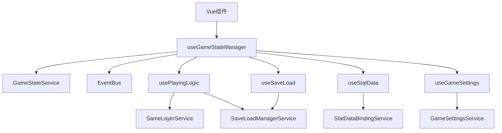
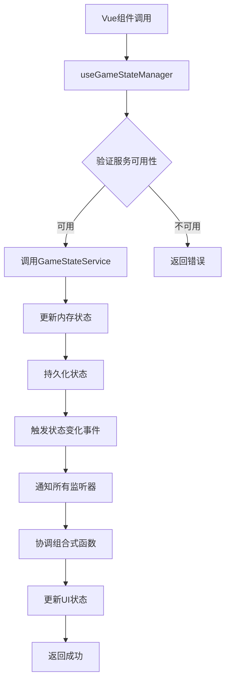

# 游戏状态管理组合式函数实现方案

## 方案概述

基于当前项目的混合模式架构，设计一个统一的 `useGameStateManager` 组合式函数，作为游戏状态切换的唯一入口，实现Vue组件层与服务层的解耦，并协调所有组合式函数的状态同步。

## 当前问题分析

### 架构问题

- **状态管理分散**：`GameStateService`、`App.vue`、各个组合式函数都在处理状态切换
- **事件监听重复**：多个地方监听相同的事件，容易造成冲突
- **缺乏统一入口**：Vue组件直接调用服务，没有统一的组合式函数接口
- **类型安全问题**：`StartView.vue` 中直接注入 `gameStateService` 但类型未定义

### 具体问题

- `App.vue` 中同时监听 `GameStateService` 和 `EventBus` 事件
- `usePlayingLogic` 中重复设置状态监听器
- 各组合式函数之间缺乏协调机制
- 状态切换逻辑分散在多个文件中

## 解决方案设计

### 核心设计原则

1. **单一入口**：`useGameStateManager` 作为唯一的状态切换入口
2. **解耦架构**：Vue组件不直接调用服务，通过组合式函数协调
3. **统一协调**：所有组合式函数通过状态管理器协调工作
4. **类型安全**：完整的TypeScript类型支持
5. **错误处理**：统一的错误处理和用户反馈机制

### 架构设计



## 实现方案

### 1. 核心组合式函数设计

```typescript
// composables/useGameStateManager.ts
export interface GameStateTransitionOptions {
  saveName?: string;
  creationData?: CreationData;
  skipPersistence?: boolean;
  silent?: boolean; // 不触发UI反馈
}

export interface GameStateManager {
  // 状态查询
  currentPhase: ComputedRef<GamePhase>;
  currentState: ComputedRef<GameState>;
  isTransitioning: ComputedRef<boolean>;
  
  // 状态切换方法
  transitionToInitial: (options?: GameStateTransitionOptions) => Promise<boolean>;
  transitionToCreation: (options?: GameStateTransitionOptions) => Promise<boolean>;
  transitionToPlaying: (options?: GameStateTransitionOptions) => Promise<boolean>;
  
  // 状态更新方法
  updateCreationData: (data: CreationData) => Promise<boolean>;
  startNewGame: () => Promise<boolean>;
  resetGameState: () => Promise<boolean>;
  
  // 状态监听
  onStateChange: (callback: (newState: GameState) => void) => () => void;
  onPhaseChange: (callback: (newPhase: GamePhase) => void) => () => void;
  
  // 服务状态
  isServiceAvailable: ComputedRef<boolean>;
  getServiceStatus: () => ServiceStatus;
}
```

### 2. 状态切换流程



### 3. 组合式函数协调机制

```typescript
// 状态切换时的协调逻辑
const coordinateComposables = async (newState: GameState) => {
  const phase = newState.phase;
  
  switch (phase) {
    case GamePhase.INITIAL:
      // 清理所有数据，重置状态
      await Promise.all([
        clearPlayingData(),
        clearCreationData(),
        resetAllComposables()
      ]);
      break;
      
    case GamePhase.CREATION:
      // 初始化创建相关数据
      await Promise.all([
        initializeCreationData(),
        setupCreationListeners()
      ]);
      break;
      
    case GamePhase.PLAYING:
      // 恢复游戏状态，协调所有组合式函数
      await Promise.all([
        restorePlayingData(newState),
        syncStatData(),
        syncSaveLoadData(),
        setupPlayingListeners()
      ]);
      break;
  }
};
```

### 4. 事件规范

```typescript
// 标准化的事件名称和数据结构
interface GameStateEvents {
  // 状态变化事件
  'game:state-changed': { newState: GameState; oldState: GameState };
  'game:phase-changed': { newPhase: GamePhase; oldPhase: GamePhase };
  
  // 状态切换事件
  'game:transition-start': { targetPhase: GamePhase; options?: GameStateTransitionOptions };
  'game:transition-complete': { targetPhase: GamePhase; success: boolean };
  'game:transition-failed': { targetPhase: GamePhase; error: Error };
  
  // 组合式函数协调事件
  'game:composable-sync': { phase: GamePhase; composable: string };
  'game:composable-ready': { phase: GamePhase; composable: string };
}
```

### 5. 错误处理规范

```typescript
interface GameStateError extends Error {
  code: 'SERVICE_UNAVAILABLE' | 'TRANSITION_FAILED' | 'PERSISTENCE_ERROR' | 'VALIDATION_ERROR';
  phase?: GamePhase;
  options?: GameStateTransitionOptions;
  originalError?: Error;
}
```

## 集成方案

### 1. 现有组合式函数改造

**usePlayingLogic 改造**

```typescript
// 移除直接的状态监听，改为通过 useGameStateManager 协调
export function usePlayingLogic() {
  const gameStateManager = useGameStateManager();
  
  // 移除原有的 setupGameStateListener
  // 改为注册到 gameStateManager 的协调机制中
  const registerPlayingLogic = () => {
    gameStateManager.onPhaseChange(async (newPhase) => {
      if (newPhase === GamePhase.PLAYING) {
        await restorePlayingState();
      }
    });
  };
  
  return {
    // 原有功能保持不变
    ...existingLogic,
    // 新增注册方法
    registerPlayingLogic
  };
}
```

**useStatData 改造**

```typescript
// 集成到状态管理协调机制中
export function useStatData() {
  const gameStateManager = useGameStateManager();
  
  const registerStatData = () => {
    gameStateManager.onPhaseChange(async (newPhase) => {
      if (newPhase === GamePhase.PLAYING) {
        await loadGameStateData();
      }
    });
  };
  
  return {
    // 原有功能保持不变
    ...existingLogic,
    registerStatData
  };
}
```

### 2. Vue组件层改造

**StartView.vue 改造示例**

```typescript
// 移除直接的服务注入，改为使用组合式函数
export default defineComponent({
  setup() {
    const gameStateManager = useGameStateManager();
    const { showSuccess, showError } = useGameServices();
    
    // 简化的状态切换调用
    const startCreation = async () => {
      try {
        const success = await gameStateManager.transitionToCreation();
        if (success) {
          showSuccess('开始创建', '进入角色创建流程');
        } else {
          showError('启动创建流程失败');
        }
      } catch (error) {
        console.error('[StartView] Failed to start creation:', error);
        showError('启动创建流程失败');
      }
    };
    
    return {
      startCreation,
      // 其他功能保持不变
    };
  }
});
```

**App.vue 简化方案**

```typescript
// 大幅简化，只负责组件切换
export default defineComponent({
  setup() {
    const gameStateManager = useGameStateManager();
    
    // 直接使用组合式函数提供的响应式状态
    const currentPhase = gameStateManager.currentPhase;
    
    return {
      currentPhase
    };
  }
});
```

### 3. 服务协调机制

```typescript
// useGameStateManager 中的协调逻辑
const coordinateComposables = async (newState: GameState) => {
  const phase = newState.phase;
  
  // 通知所有注册的组合式函数
  const composableCallbacks = getRegisteredComposables(phase);
  
  try {
    await Promise.all(
      composableCallbacks.map(callback => callback(newState))
    );
    
    emitEvent('game:composable-sync', { phase, composable: 'all' });
  } catch (error) {
    console.error('[useGameStateManager] 组合式函数协调失败:', error);
    throw error;
  }
};
```

## 实现优势

### 1. 维护性

- 状态切换逻辑集中管理，易于维护和调试
- 统一的错误处理和用户反馈机制
- 清晰的职责分工和模块边界

### 2. 可测试性

- 组合式函数可以独立测试
- 服务层与视图层解耦，便于单元测试
- 状态切换逻辑可以单独验证

### 3. 扩展性

- 新增状态或组合式函数时，只需注册到协调机制中
- 支持插件化的状态切换扩展
- 易于添加新的状态监听器

### 4. 一致性

- 所有状态切换都遵循相同的模式和错误处理
- 统一的类型定义和接口规范
- 标准化的事件命名和数据结构

### 5. 性能

- 避免重复的事件监听和状态同步
- 统一的状态更新机制，减少不必要的重渲染
- 智能的缓存和批量更新策略

## 迁移策略

### 1. 渐进式改造

1. **阶段1**：实现 `useGameStateManager` 基础功能
2. **阶段2**：改造现有组合式函数，添加注册机制
3. **阶段3**：改造Vue组件，移除直接服务调用
4. **阶段4**：完善错误处理和用户体验

### 2. 向后兼容

- 保持现有API不变，新增协调机制
- 逐步迁移，确保功能正常
- 提供降级方案，确保系统稳定性

### 3. 测试验证

- 每个阶段都进行充分测试
- 验证状态切换的正确性
- 确保组合式函数协调机制正常工作
- 测试错误处理和降级机制

## 实施计划

### 第1周：基础架构

- [ ] 创建 `useGameStateManager` 组合式函数
- [ ] 实现基础的状态切换方法
- [ ] 添加类型定义和接口规范
- [ ] 实现错误处理机制

### 第2周：组合式函数集成

- [ ] 改造 `usePlayingLogic`，添加注册机制
- [ ] 改造 `useStatData`，集成协调机制
- [ ] 改造 `useSaveLoad`，添加状态监听
- [ ] 实现组合式函数协调逻辑

### 第3周：Vue组件改造

- [ ] 改造 `StartView.vue`，使用新的状态管理
- [ ] 改造 `App.vue`，简化状态切换逻辑
- [ ] 改造 `PlayingRoot.vue`，集成新的协调机制
- [ ] 测试组件间的状态同步

### 第4周：完善和优化

- [ ] 完善错误处理和用户反馈
- [ ] 优化性能和响应速度
- [ ] 添加完整的测试用例
- [ ] 更新文档和使用指南

## 风险评估

### 技术风险

- **低风险**：基于现有架构，技术方案成熟
- **中风险**：组合式函数协调机制需要仔细设计
- **高风险**：暂无

### 实施风险

- **低风险**：渐进式改造，影响范围可控
- **中风险**：需要确保向后兼容性
- **高风险**：暂无

## 总结

这个方案能够有效解决当前游戏状态切换中的架构问题，实现真正的解耦和统一管理。通过创建 `useGameStateManager` 组合式函数，我们可以：

1. **统一状态管理**：所有状态切换都通过单一入口进行
2. **解耦架构**：Vue组件不再直接调用服务
3. **协调机制**：所有组合式函数通过状态管理器协调工作
4. **类型安全**：完整的TypeScript类型支持
5. **错误处理**：统一的错误处理和用户反馈机制

这个方案符合项目现有的混合模式架构，能够无缝集成到现有系统中，同时为未来的扩展提供良好的基础。
