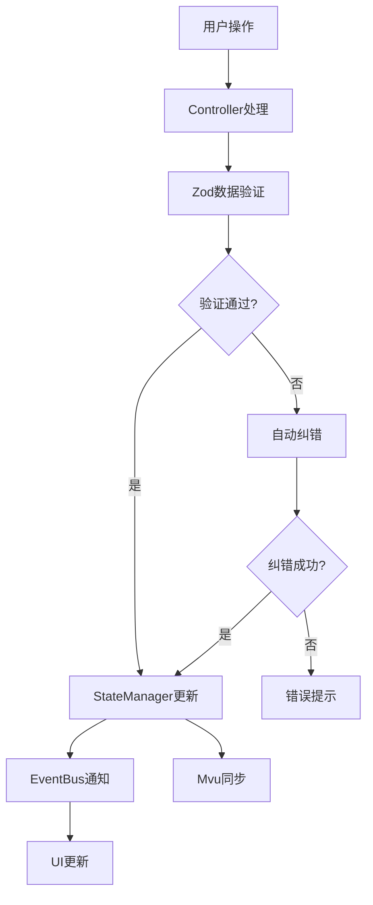
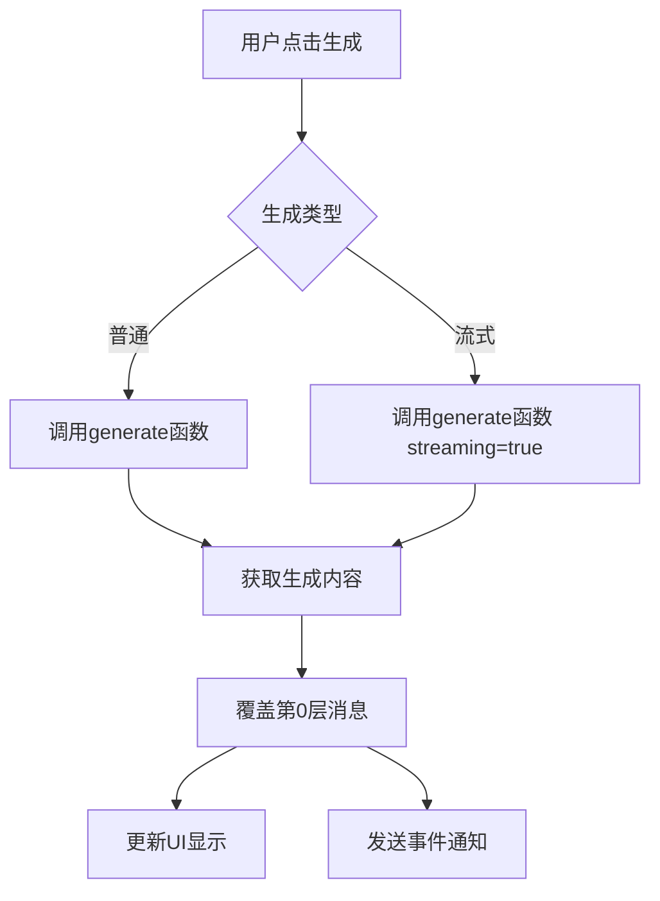
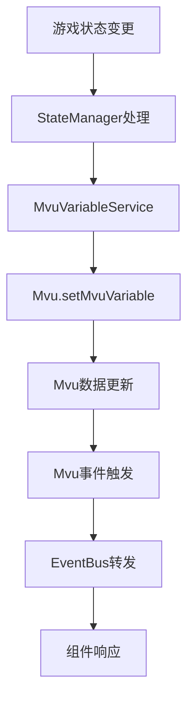

# 同层游玩RPG 架构说明

## 重构目标

本次重构的目标是将原本耦合度较高的单文件代码重构为模块化、可维护的现代架构，符合以下要求：

1. **解耦架构**: 各模块职责单一，依赖关系清晰
2. **酒馆助手集成**: 基于酒馆助手和SillyTavern开发，不自建系统
3. **TypeScript最佳实践**: 严格类型检查和现代化开发模式
4. **jQuery优先**: 使用jQuery进行DOM操作
5. **Zod数据验证**: 使用Zod处理数据校验和纠错
6. **Mvu变量管理**: 使用Mvu变量框架管理酒馆变量

## 架构设计

### 核心层 (Core)

#### GameCore - 中央协调器

- **职责**: 管理整个游戏的初始化、组件注册、生命周期
- **模式**: 单例模式
- **功能**:
  - 统一的错误处理
  - 服务初始化和清理
  - 控制器路由和渲染

#### ServiceLocator - 服务定位器

- **职责**: 依赖注入和服务生命周期管理
- **特性**:
  - 支持工厂模式和单例模式
  - 依赖解析和注入
  - 服务统计和调试信息
  - 异步服务支持

#### EventBus - 事件总线

- **职责**: 组件间松耦合通信
- **特性**:
  - 命名空间和通配符支持
  - 一次性监听器
  - 异步事件处理
  - 调试和统计功能

#### StateManager - 状态管理器

- **职责**: 游戏状态的统一管理
- **特性**:
  - Zod验证和自动纠错
  - 状态历史和回退
  - 响应式更新
  - 状态订阅机制

### 服务层 (Services)

#### MvuVariableService - Mvu变量服务

- **职责**: 基于Mvu框架的变量管理
- **功能**:
  - 统一的Mvu变量操作接口
  - Mvu事件监听和转发
  - 游戏状态与Mvu数据同步

#### SameLayerService - 同层服务

- **职责**: 第0层消息管理和AI生成集成
- **功能**:
  - 获取第0层消息内容
  - 覆盖第0层消息（不继续生成后续层）
  - 支持流式和非流式AI生成
  - 使用酒馆助手的generate函数

#### WorldbookService - 世界书服务

- **职责**: 世界书和存档管理
- **功能**:
  - 游戏状态的持久化
  - 多种存档策略
  - 世界书条目管理

#### AchievementService - 成就系统

- **职责**: 游戏成就的管理和追踪
- **功能**:
  - 事件驱动的成就解锁
  - 进度型成就支持
  - 成就统计和分类

### 控制器层 (Controllers)

#### BaseController - 基础控制器

- **职责**: 提供控制器的基础功能
- **功能**:
  - 统一的生命周期管理
  - 服务访问的便捷方法
  - 事件和状态操作的封装

#### StartController - 开始界面控制器

- **职责**: 管理游戏开始界面
- **功能**: 开始游戏、读档、成就查看、全屏切换

#### CreationController - 角色创建控制器

- **职责**: 管理分步角色创建流程
- **功能**:
  - 难度选择（Zod验证）
  - 世界选择（Zod验证）
  - 属性分配（自动纠错）
  - 天赋选择
  - 步骤导航和验证

#### PlayController - 游戏界面控制器

- **职责**: 管理游戏主界面
- **功能**:
  - AI内容生成（流式和非流式）
  - 存档和读档操作
  - 游戏信息显示
  - Mvu状态同步

### 数据层 (Models)

#### schemas.ts - 数据模式和验证

- **Zod模式定义**: 所有游戏数据的验证规则
- **类型导出**: TypeScript类型定义
- **验证函数**: 数据验证和自动纠错函数
- **工具函数**: 状态创建和更新的辅助函数

## 数据流

### 状态管理流程



### AI生成流程



### 变量管理流程



## 最佳实践

### 开发规范

1. **使用jQuery**: 所有DOM操作使用jQuery，避免原生JavaScript
2. **Zod验证**: 所有数据输入必须通过Zod验证
3. **事件驱动**: 组件间通信使用EventBus，避免直接调用
4. **服务定位**: 通过ServiceLocator获取服务，支持依赖注入
5. **错误处理**: 统一的错误处理和用户反馈

### 扩展指南

1. **添加新服务**: 继承基础接口，注册到ServiceLocator
2. **添加新控制器**: 继承BaseController，实现mount/unmount
3. **添加新事件**: 使用命名空间，遵循事件命名规范
4. **添加新验证**: 在schemas.ts中定义Zod模式
5. **添加新成就**: 在AchievementService中定义并监听相关事件

### 调试技巧

```typescript
// 查看服务状态
ServiceLocator.printDebugInfo();

// 查看事件统计
eventBus.printDebugInfo();

// 查看状态快照
stateManager.getStateSnapshot();

// 查看Mvu数据
const mvuData = mvuVariableService.getMvuData();
console.log(mvuData);
```

## 与酒馆助手的集成

### 变量管理

- 使用`Mvu.getMvuData()`获取变量
- 使用`Mvu.setMvuVariable()`设置变量
- 监听`Mvu.events.VARIABLE_UPDATE_ENDED`事件

### AI生成

- 使用`generate()`函数获取AI内容
- 支持`should_stream`参数控制流式生成
- 通过`getChatMessages()`和`setChatMessages()`管理消息

### 消息管理

- 使用`getChatMessages('0')`获取第0层消息
- 使用`setChatMessages()`覆盖消息内容
- 避免触发后续层的生成

这个重构后的架构确保了代码的可维护性、可扩展性和与酒馆助手的良好集成。
